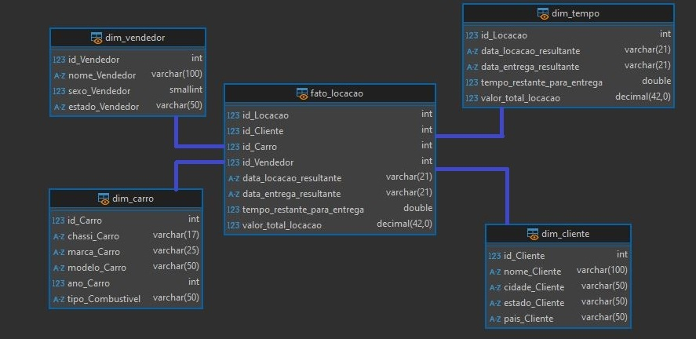
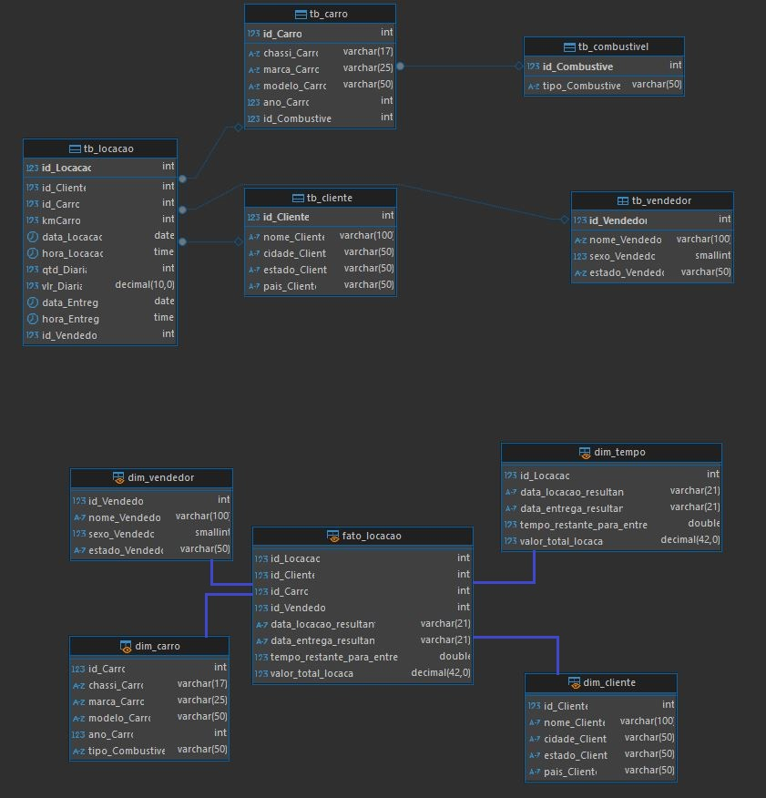

# Etapas

---

1- [Etapa I](../Desafio/etapa-1/)

Nessa etapa o objetivo é realizar a normalização do banco de dados **concessionaria.zip**,partindo pros conceitos de normalização utilizando as formas normais, nos deparamos com a primeira forma normal (1FN), que tem como objetivo retirar os atributos ou grupos repetitivos, que são representações de informações que se repetem para uma mesma unidade, gerando ocorrências a uma mesma entidade.

Analisando os dados do banco utilizando uma simples comando de consulta,

``` SQL
Select * from tb_locacao 
```

obtive o seguinte retorno


Analisando as colunas, é perceptível que a tabela está em 1FN, não existem campos multivalores, e os dados estão atômico, apesar do cliente vinte e dois aparecer várias vezes, cada ocorrência está em uma linha, o que é permitido pela 1FN

Porém ela infringe a 2FN, forma normal essa que explicitamente tem o objetivo de separar as dependências parciais, sendo elas identificadas e individualizadas, é necessária a criação de novas tabelas, existe dependência parcial nas seguintes colunas:


Na imagem acima podemos ver que as colunas **nomeCliente, cidadeCliente, estadoCliente e paisCliente** dependem não só da chave da entidade (id_locacao) mas tambem da idCliente, logo é considerada dependência parcial, e deve-se criar uma nova entidade para abrigar esses atributos parcialmente dependentes, com a idCliente se tornando chave estrangeira da entidade principal (tblocacao)


Na imagem acima, as colunas **chassiCarro, marcaCarro, modeloCarro, anoCarro** dependetem parcialmente tanto da idCarro, quanto do atributo chave da entidade (idLocacao), seguindo o exemplo da situação anterior, temos que criar uma nova entidade para abrigar esses atributos parcialmente dependentes, com a idCarro se tornando chave estrangeira da entidade principal (tbLocacao), o atributo kmCarro por outro lado, não depende da idCarro, e sim da chave primária da tabela, logo não deve ser separado como os demais.


Na imagem acima a coluna **tipoCombustivel** depende parcialmente da coluna idCombustivel e do atributo chave, logo é necessário criar uma nova entidade para abrigar esse atributo, com a idCombustivel se tornando chave estrangeira da entidade principal (tbLocacao)


Por último, na imagem acima as colunas **nomeVendedor, sexoVendedor, estadoVendedor** dependem da idVendedor, assim como dependem do atributo chave da entidade, portanto, é se criada uma nova tabela abrigando essas colunas, com a idVendedor se tornando chave estrangeira da entidade principal (tbLocacao)

Fazendo a criação das novas tabelas, com inserção dos dados e verificação de funcionamento utilizando simples consultas

Obtive o retorno do seguinte diagrama


Logo, podemos concluir que a nosso banco está normalizado pelas regras da 2FN, para replicar a construção do banco de dados em 2FN o arquivo.sql com as queries necessárias está disponível aqui

[QueryEtapa1_2FN](../Desafio/etapa-1/concessionaria_2FN.sql) para 2FN

Partindo pra 3FN, que tem como objetivo eliminar dependências transitivas, ou seja, atributos não-chave que são, atributos que não são dependentes diretamente da chave, mas sim por transitividade, ou seja, por outros atributos não-chave, é o caso que vemos a seguir


Como vemos na imagem acima, o atributo chave estrangeira idCombustivel, depende diretamente de outro atributo estrangeiro idCarro, pra resolver esse problema, apenas incluí o idCombustivel como um atributo do idCarro, assim o relacionamento entre as duas entidades ficou assim


Agora podemos considerar de vez nosso banco de dados normalizado com as três formas normais, os atributos kmCarro, data/hora locação/entrega, valorDiaria e qtdDiaria, são totalmente dependentes da chave primária da entidade e devem continuar sendo atributos não-chave dela

Olhando o resultado final do nosso banco de dados, o diagrama é formado após a normalização é esse


Para replicar a construção dos bancos de dados em 3FN o arquivo .sql com as queries necessárias está disponível aqui

[QueryEtapa1_3FN](../Desafio/etapa-1/concessionaria_3FN.sql) para 3FN

Finalizado a Etapa 1, com o nosso banco normalizado, partiremos agora para a Etapa 2 onde iremos realizar a construção de um Diagrama Dimensional oriundo desse nosso Diagrama Relacional

---
---
---

2- [Etapa 2](../Desafio/etapa-2/)

Nessa etapa o objetivo é realizar a modelagem dimensional do nosso banco de dados **concessionaria.zip** recem normalizado pelas formas normais. O objetivo da modelagem dimensional é realizar utilizar sua técnica de design de banco de dados (usada muito em Data Warehouses) para facilitar a análise e geração de relatórios, essa técnica organiza nosso banco de dados em tabelas de Dimensões (armazenam informações descritivas de fatos) e Tabelas de Fato (armazenam dados numéricos de regras de negócios).

As tabelas dimensões são views criadas para responder perguntas, olhando pro nosso banco normalizado, nos perguntamos:

- Quem fez a locação?
- Qual carro foi locado?
- Qual vendedor realizou a locação?
- Quando foi realizada a locação?

Todas essas perguntas são respondidas criando dimensões específicas que descrevem o oque, quem, onde e quando de um determinado fato.

Para criarmos as dimensões de nosso bando, utilizados a função

```SQL
Create View dim_nome as
select atributo1
       atribute2
       ...;
```

em nosso caso, criaremos uma dimesão **dim_Cliente** para responder a primeira pergunta (Quem fez), uma segunda dimensão **dim_Carro** para responder a segunda pergunta (Qual carro), uma terceira dimensão **dim_Vendedor** para responder a terceira pergunta (Quem vendeu) e uma quarta dimensão **dim_Tempo** para responder a quarta pergunta (Quando foi)

As tabelas fatos registra os eventos da locação, ou seja, de todas as ações realizadas ao longo do tempo de forma centralizada, tendo dados métricos de interesse (kmCarro, qtd_Diaria, valor_Diaria) e referenciando as diferentes dimensões criadas através de chaves estrangeiras

A Query SQL para criação das views das Dimensões e do Fato, podem ser encontrados aqui

[ScriptSQLViews](../Desafio/etapa-2/concessionaria_queries_dimensional.sql) Query Views

Realizando a Query e criando as novas dimensões, temos o seguinte diagrama dimensional resultante



Como podemos ver acima as dimensões foram organizadas no Modelo Dimensional Star Schema (Esquema Estrela) com a Fato sendo o centro da nossa modelagem, com as dimensões ao redor, em formado de estrela, relacionadas ao Fato através das chaves estrangeiras que os ligam

O resultado final do desafio, com a modelagem relacional baseada nas formas normais e na modelagem dimensional baseado na Star Schema, é a seguinte


