# Instruções

Este arquivo será o relato da sua entrega. Neste arquivo você fará a organização geral ao longo da Sprint. Esperamos que haja, minimamente:

- Uma ou mais seções para descrever o que estiver aprendendo (resumo), de maneira estruturada.

- Breve conteúdo de cada pasta relacionada a sprint.

# Resumo

## Scrum

- Pude aprender sobre a importância da métodologia ágil Scrum, pelo seu coletivismo e integração, gerando valor através de seu framework.  
- Estágios do processo (**To Do** (A Fazer), **WIP** (Work In Progress | Em Progresso), **Done** (Feito)) 

- Elementos como os **Papéis** (P.O, S.M, Time de Desenvolvimento), **Artefatos** (Backlog, Product/Sprint Backlog, Histórias e o gráfico Burndown), e os **Eventos** (Sprint, Daily Scrum, Sprint Review/Retrospect)

## Fundamentos de Segurança

- No Módulo 0, aprendi sobre **InfoSec**, que se descreve como a proteção de informações visando ofereçer proteção e valor aos dados, aprendi sobre a Tríade CID (Confidencialidade, Integridade e Disponibilidade), e as políticas PSI e PCI  

- No Módulo 1, aprendi sobre **Classifição das Informações**, dividida em níveis (Confidencial, Restritas, Internas e Públicas) perante a sensibilidade, criticidade e valor da informação  

- No Módulo 2, aprendi sobre **Engenharia Social**, sua definição baseada na exploração da boa-fé humana e simpatia do alvo por criminosos, suas técnicas (Baiting, Phishing (Smishing e Vishing) e Dumpster Giving), e como se prevenir (descarte correto, leitura atenta, validação de links suspeitos, etc)  

- No Módulo 3, aprendi sobre **Boas Práticas e Diretrizes**, sendo elas Compatilhamento de Acesso, Armazenamento, Softwares e Hardwares, Senha Segura, Uso de Internet, MFA, MSAuthenticator, Atualização de Segurança, Incidentes de Segurança, Como Reportar Um Incidente, e Redes WIFI (Abertas, Fechadas, Públicas ou Privadas)

- No módulo 4, aprendi sobre Segurança em **IA Generativa**, o que é, Ambiente e Dissolução de Ferramentas IA, Como Proteger Dados e Informações, e os Controles Mínimos de Segurança, este através de processos como Homologação, Análise de Risco, Documentação de Manuais, JIRA, e Treinamentos Obrigatórios

## SQL (Structured Query Language)

- Na Seção 3, aprendi sobre os comandos básicos de SQl (Select, Distinct, Where, Order By e Limit)

- Na Seção 4, aprendi sobre os operadores Aritméticos (+, -, *, /); de Comparação (>, <, >=, <=, <>) e Lógicos (OR, AND, NOT, (NOT) IN, (NOT) BETWEEN)

- Na Seção 5, aprendi sobre funções agregadas (Count, Sum, MAX, MIN, AVG, Group By, Having)

- Na Seção 6, aprendi sobre os diferentes Joins (Left, Right, Inner, Full)

- Na Seção 7 aprendi sobre Unions (remove duplicatas) e Union All (não remove duplicatas)

- Na Seção 8, aprendi sobre subqueries e seus tipos (aplicadas em WHERE, WITH, FROM, SELECT)

- Na Seção 9, aprendi sobre Tratamento de Dados (geral, datas, texto) e a converter unidades com os operadores :: ("ponto ponto") e CAST

- Na Seção 10, aprendi sobre manipulação de tabelas (criação e deleção), linhas e colunas (inserção, atualização e deleção)

## Modelagem Relacional e Dimensional
# Exercícios

## Exercícios SQL

1. ...
[Resposta Ex1.](./Exercicios/Case_Biblioteca/ex1.sql)

2. ...
[Resposta Ex2.](./Exercicios/Case_Biblioteca/ex2.sql)

3. ...
[Resposta Ex3.](./Exercicios/Case_Biblioteca/ex3.sql)

4. ...
[Resposta Ex4.](./Exercicios/Case_Biblioteca/ex4.sql)

5. ...
[Resposta Ex5.](./Exercicios/Case_Biblioteca/ex5.sql)

6. ...
[Resposta Ex6.](./Exercicios/Case_Biblioteca/ex6.sql)

7. ...
[Resposta Ex7.](./Exercicios/Case_Biblioteca/ex7.sql)

8. ...
[Resposta Ex8.](./Exercicios/Case_Loja/ex8.sql)

9. ...
[Resposta Ex9.](./Exercicios/Case_Loja/ex9.sql)

10. ...
[Resposta Ex10.](./Exercicios/Case_Loja/ex10.sql)

11. ...
[Resposta Ex11.](./Exercicios/Case_Loja/ex11.sql)

12. ...
[Resposta Ex12.](./Exercicios/Case_Loja/ex12.sql)

13. ...
[Resposta Ex13.](./Exercicios/Case_Loja/ex13.sql)

14. ...
[Resposta Ex14.](./Exercicios/Case_Loja/ex14.sql)

15. ...
[Resposta Ex15.](./Exercicios/Case_Loja/ex15.sql)

16. ...
[Resposta Ex16.](./Exercicios/Case_Loja/ex16.sql)

# Evidências

## EX1 SQL

- Respeitando as exigências da questão, a query foi organizada com início na coluna "**Cod**", e fim na coluna "**Idioma**", com a ordenção crescente sendo feita pela coluna "Cod", o resultado final como podemos ver a seguir, são 32 linhas retornadas em 20ms.

- Na imagem abaixo, a execução da mesma query na plataforma Udemy, confirmando o sucesso.

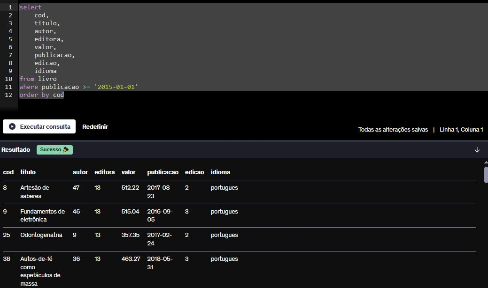

## EX2 SQL

- Respeitando as exigências da questão, a query foi organizada através da coluna valor, de forma decrescente, e através do operador "**Limit**" filtramos apenas 10 linhas, que representam os 10 livros mais caros do banco de dados de nossa biblioteca.

- Na imagem abaixo, a execução da mesma query na plataforma Udemy, confirmando o sucesso.

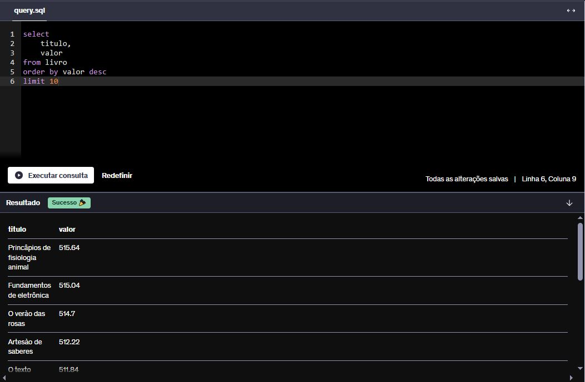

## EX3 SQL

- Respeitando as exigências da questão, a query foi organizada através da coluna calculada "**quantidade**" através do operador "**Count**", de forma decrescente, e através do operador "**Limit**" limitar a consula à no máximo 5 linhas.

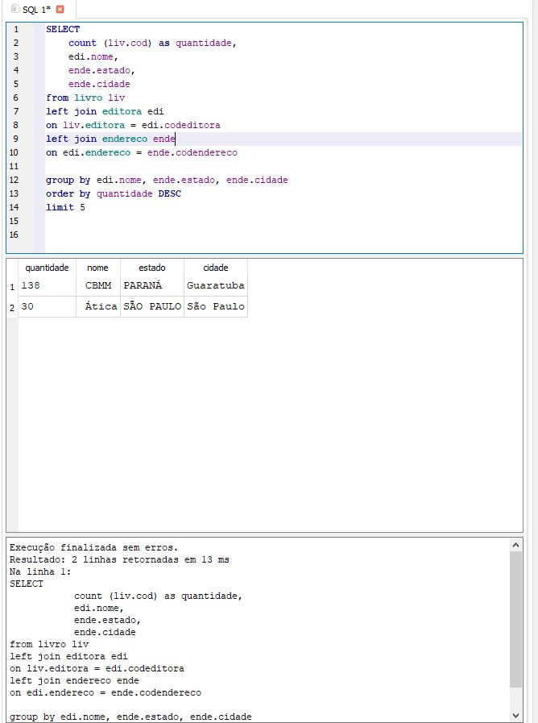

- Na imagem abaixo, a execução da mesma query na plataforma Udemy, confirmando o sucesso.

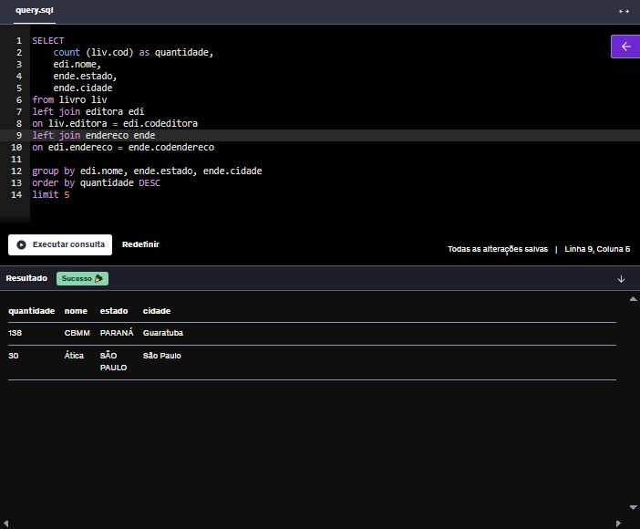

## EX4 SQL

- Respeitando as exigências da questão, a query foi organizada através da coluna nome, de forma crescente, e usando os operadores "**Count**" para realizar a construção da coluna calculada "**quantidade**".

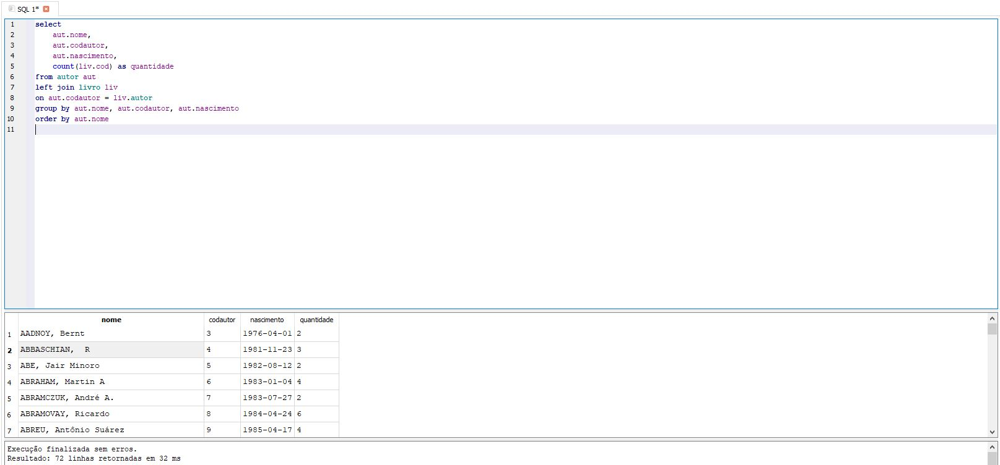

- Na imagem abaixo, a execução da mesma query na plataforma Udemy, confirmando o sucesso.

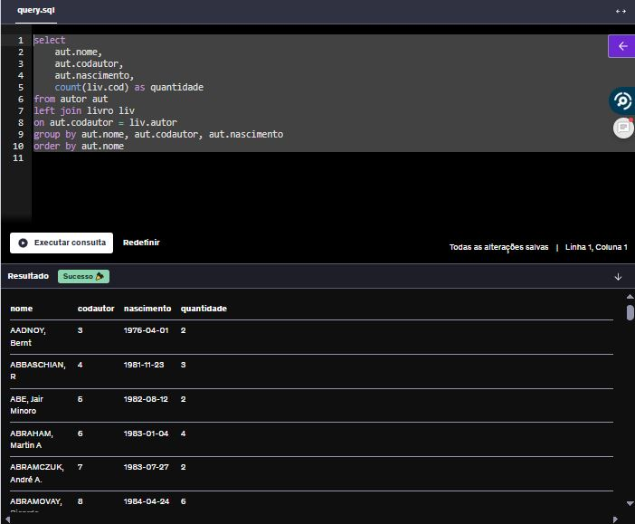

## EX5 SQL

- Respeitando as exigências da questão, a query foi organizada através da coluna nome, de forma crescente, e usando os operadores "**Left Join**" para realizar a junção das tabelas, e do operador "**Distinct**" para evitar linhas duplas.

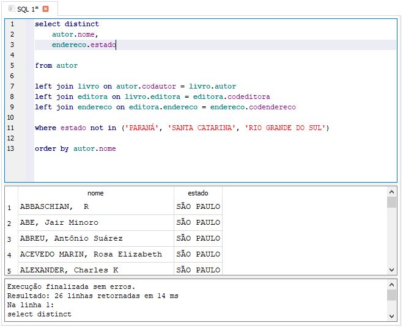

- Na imagem abaixo, a execução da mesma query na plataforma Udemy, confirmando o sucesso.

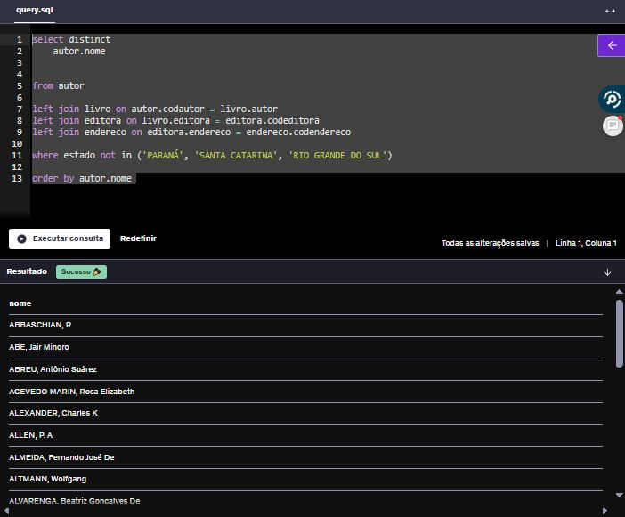

## EX6 SQL

- Respeitando as exigências da questão, a query foi organizada através da coluna nome, de forma decrescente, e usando os operadores "**Left Join**" para realizar a junção das tabelas, e do operador "**Limit**" para limitar a apenas uma linha e achar o valor com mais publicações.

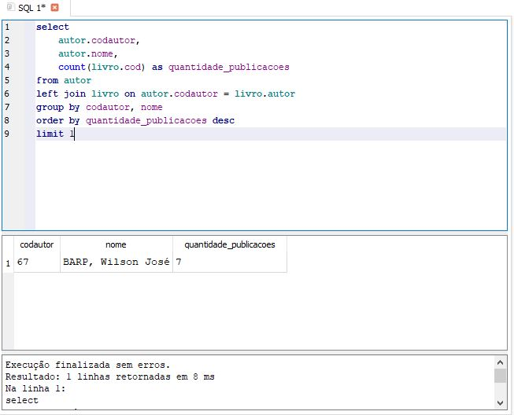

- Na imagem abaixo, a execução da mesma query na plataforma Udemy, confirmando o sucesso.

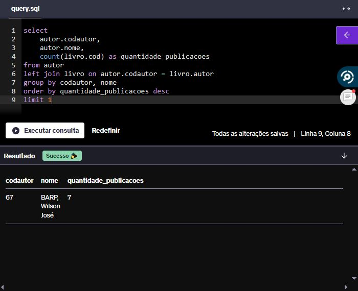

## EX7 SQL

- Respeitando as exigências da questão, a query foi organizada através da coluna nome, e usando os operadores "**Left Join**" para realizar a junção das tabelas, e do operador "**IS NULL**" para encontrar os autores com publicações nulas, ou sejas, que não tem livros publicados.

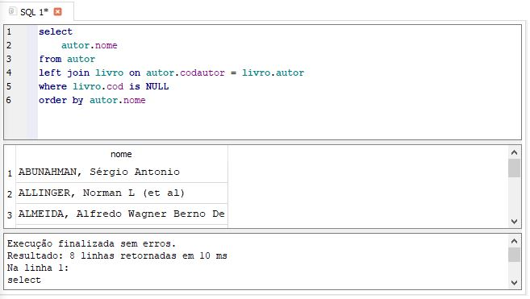

- Na imagem abaixo, a execução da mesma query na plataforma Udemy, confirmando o sucesso.

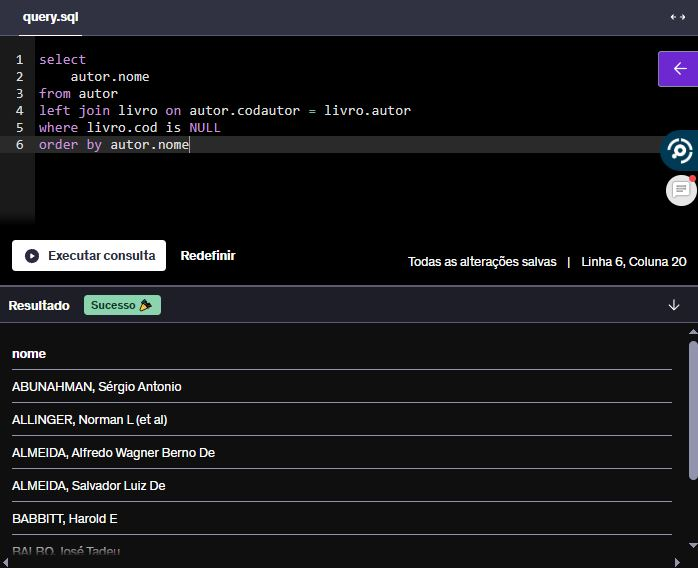

## EX8 SQL

- Respeitando as exigências da questão, a query foi organizada através do código do vendedor, e usando os operadores "**Left Join**" para realizar a junção das tabelas, e do operador "**Where**" para filtrar as linhas com status "Concluído"

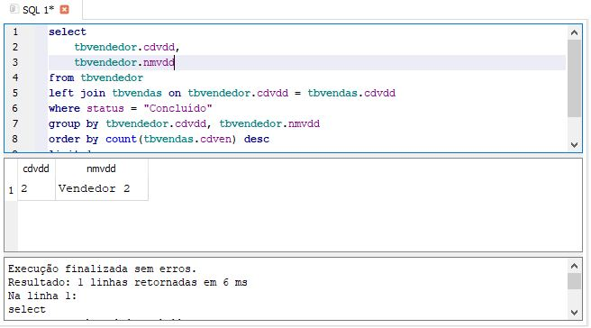

- Na imagem abaixo, a execução da mesma query na plataforma Udemy, confirmando o sucesso.

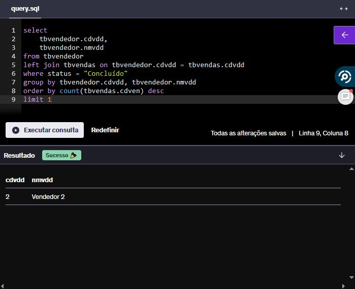

## EX9 SQL

- Respeitando as exigências da questão, a query foi organizada através do código do produto, e usando o operador "**Where**" para filtrar as linhas com status "Concluído" e em uma faixa de tempo determinada

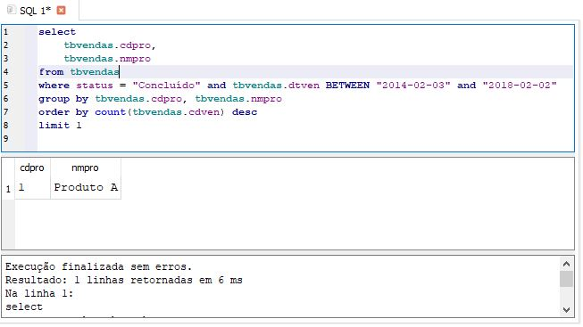

- Na imagem abaixo, a execução da mesma query na plataforma Udemy, confirmando o sucesso.

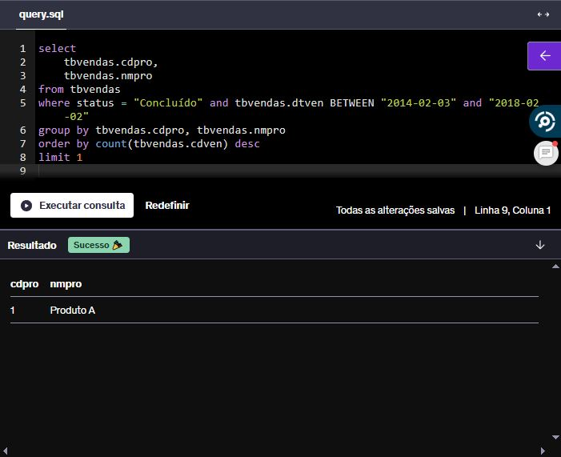

## EX10 SQL

- Respeitando as exigências da questão, a query foi organizada através do nome do vendedor, e usando os operadores "**Left Join**" para realizar a junção das tabelas, "**Where**" para filtrar as linhas com status "Concluído" e ordenada pela comissão de forma decrescente

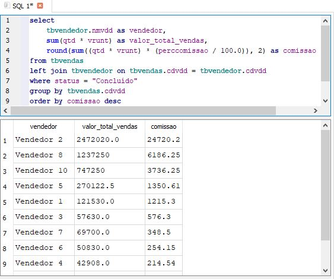

- Na imagem abaixo, a execução da mesma query na plataforma Udemy, confirmando o sucesso.

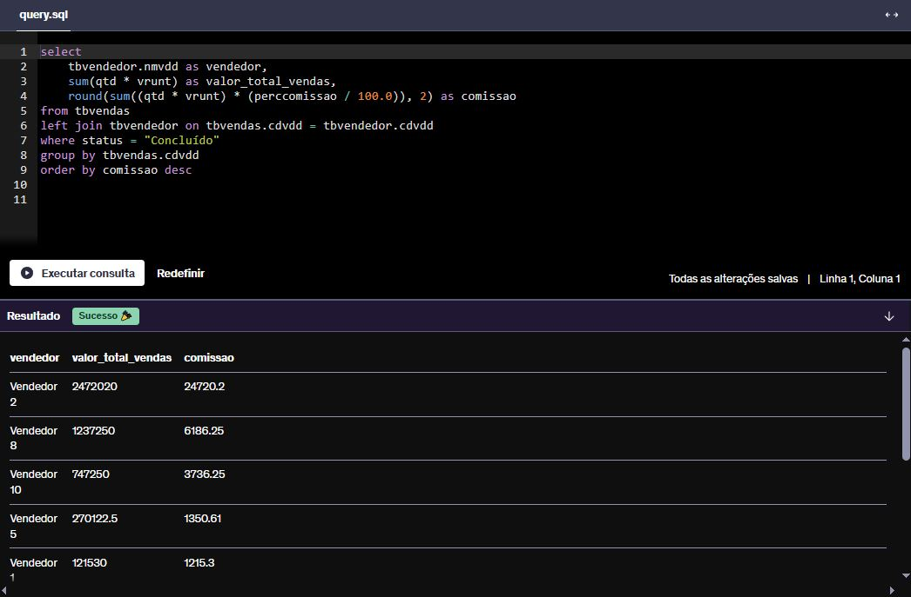

## EX11 SQL

- Respeitando as exigências da questão, a query foi organizada através do código do cliente, e usando os operadores "**Where**" para filtrar as linhas com status "Concluído", "**Limit**" para buscar um maior valor, e ordenado pelo gasto de forma decrescente

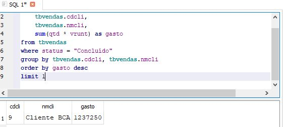

- Na imagem abaixo, a execução da mesma query na plataforma Udemy, confirmando o sucesso.

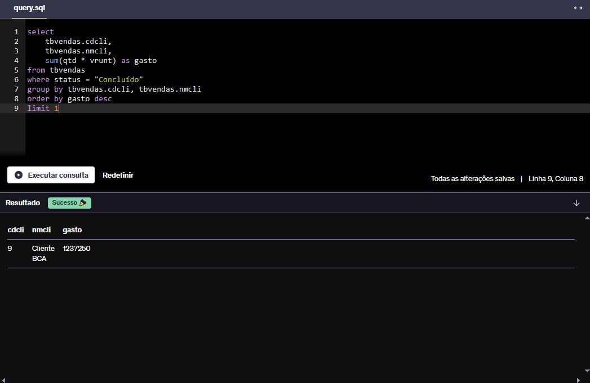

## EX12 SQL

- Respeitando as exigências da questão, a query foi organizada através do código do dependente, e usando os operadores "**Left Join**" para realizar a junção das tabelas, "**Where**" para filtrar as linhas com status "Concluído", "**Limit**" para buscar um maior valor e ordenado pelo valor total de vendas

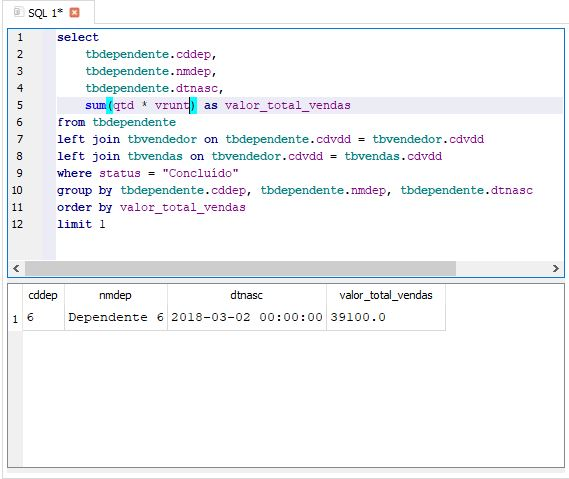

- Na imagem abaixo, a execução da mesma query na plataforma Udemy, confirmando o sucesso.

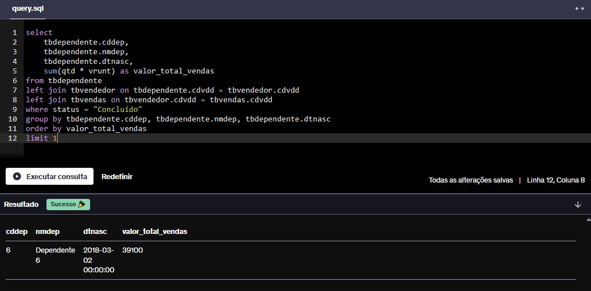

## EX13 SQL

- Respeitando as exigências da questão, a query foi organizada através do código do produto, e usando os operadores "**Where**" para filtrar as linhas com status "Concluído", "**Limit**" para buscar os dez maiores valores e ordenado pela quantidade de vendas

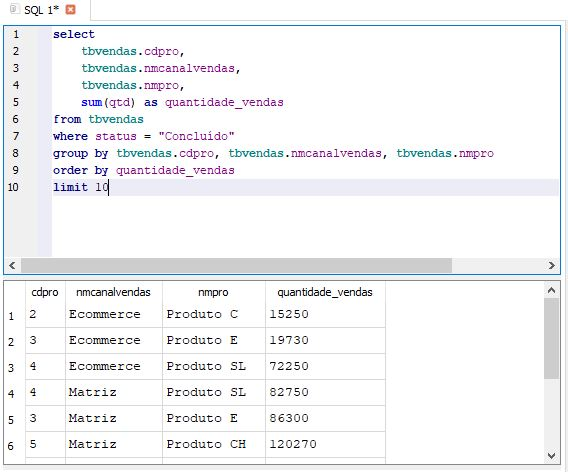

- Na imagem abaixo, a execução da mesma query na plataforma Udemy, confirmando o sucesso.

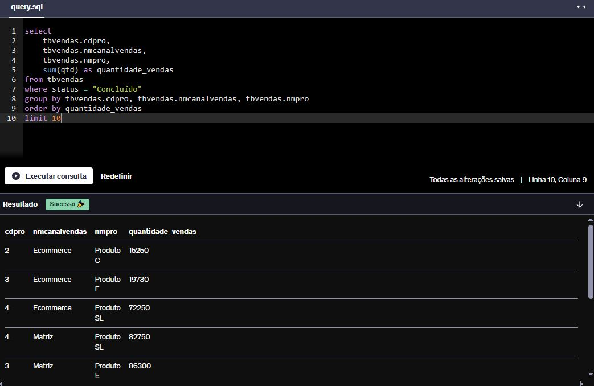

## EX14 SQL

- Respeitando as exigências da questão, a query foi organizada através do nome do estado, e usando o operador "**Where**" para filtrar as linhas com status "Concluído", ordenado pela coluna calculada com os gastos médios de cada estado de forma decrescente

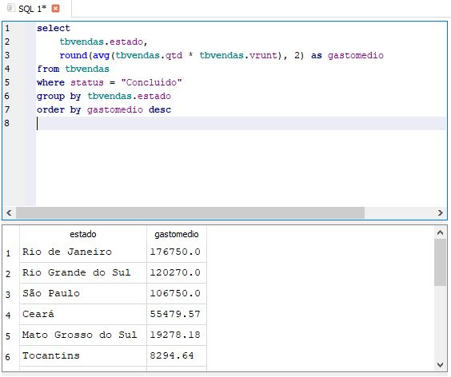

- Na imagem abaixo, a execução da mesma query na plataforma Udemy, confirmando o sucesso.

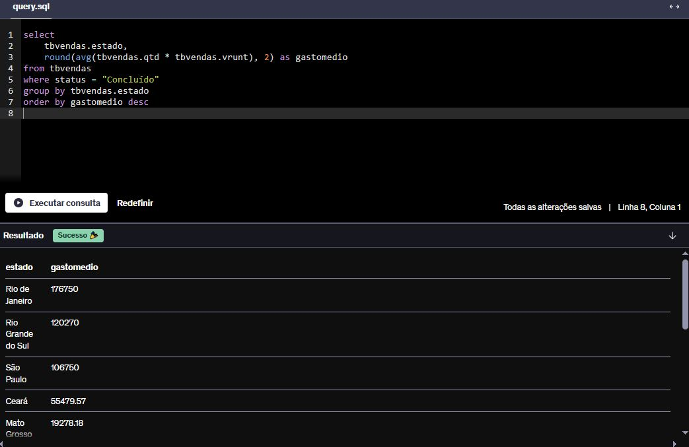

## EX15 SQL

- Respeitando as exigências da questão, a query foi organizada através do código das vendas, e usando o operador "**Where**" para filtrar que foram deletadas

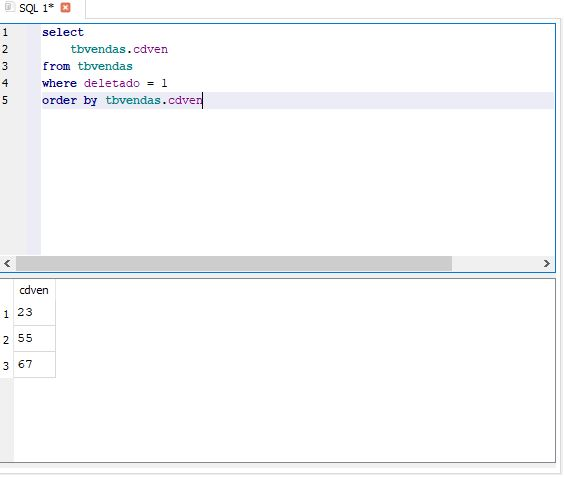

- Na imagem abaixo, a execução da mesma query na plataforma Udemy, confirmando o sucesso.

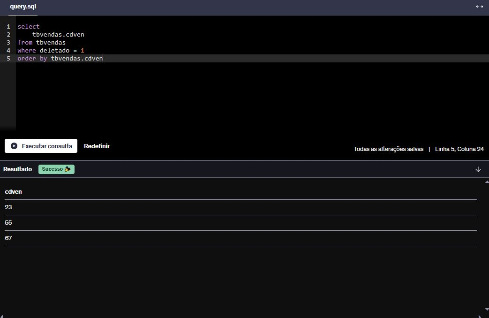

## EX16 SQL

- Respeitando as exigências da questão, a query foi organizada através do nome dos estados, e usando o operador "**Where**" para filtrar as linhas com status "Concluído"

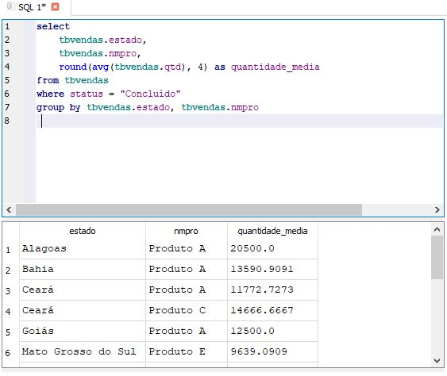

- Na imagem abaixo, a execução da mesma query na plataforma Udemy, confirmando o sucesso.

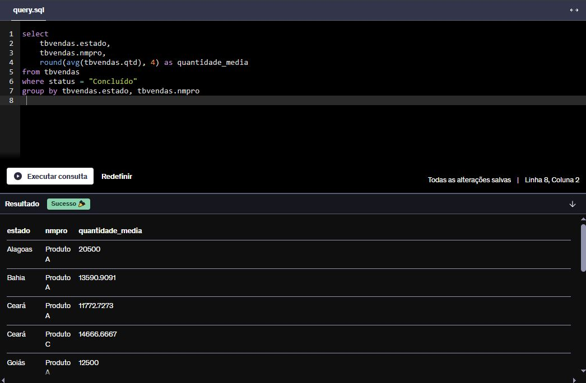

# Certificados
