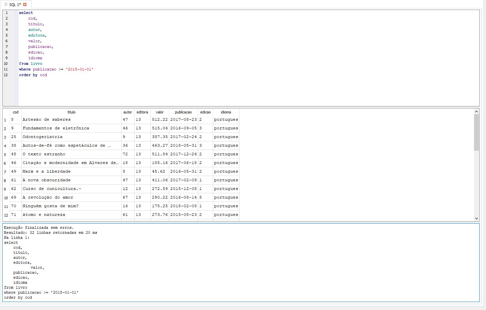
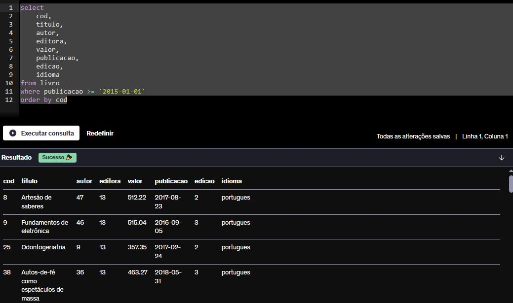
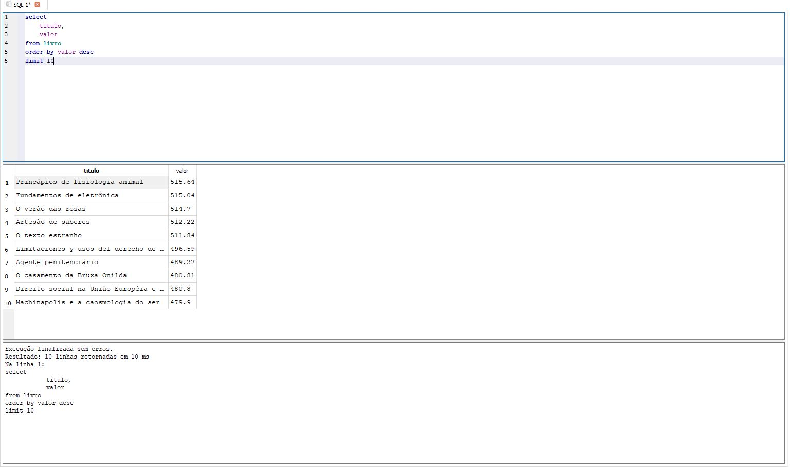
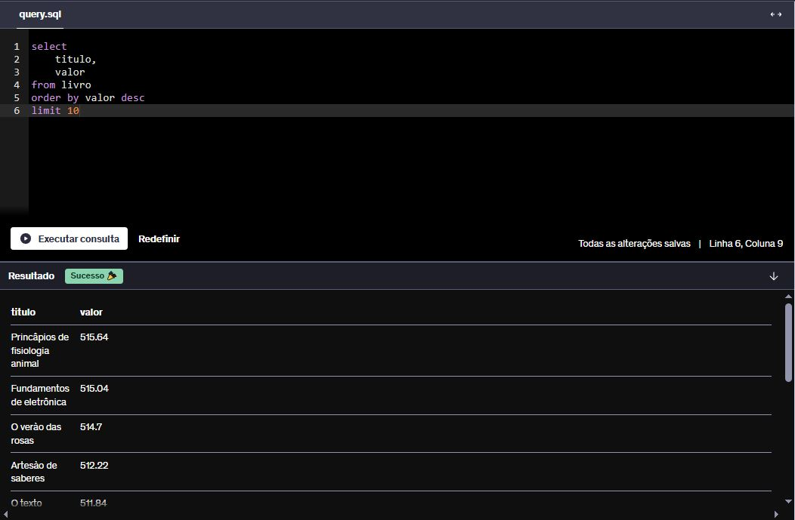
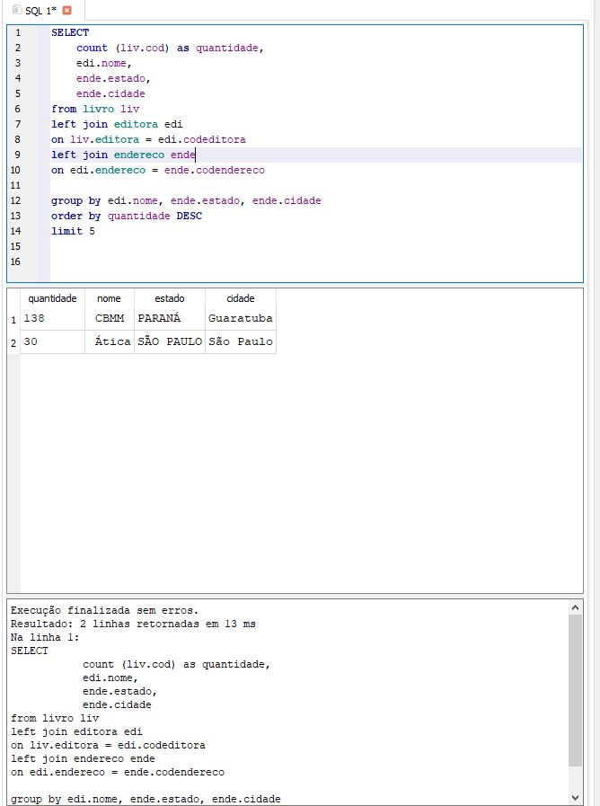
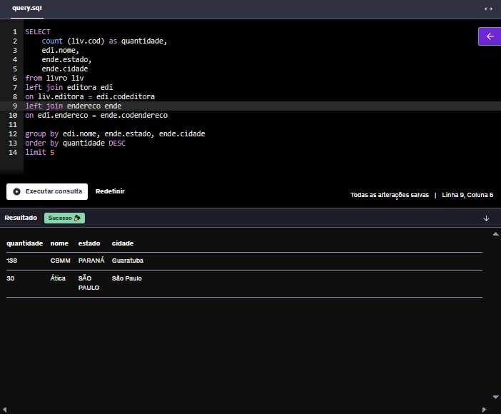

# Instruções

Este arquivo será o relato da sua entrega. Neste arquivo você fará a organização geral ao longo da Sprint. Esperamos que haja, minimamente:

- Uma ou mais seções para descrever o que estiver aprendendo (resumo), de maneira estruturada.

- Breve conteúdo de cada pasta relacionada a sprint.

# Resumo

### Scrum:

- Pude aprender sobre a importância da métodologia ágil Scrum, pelo seu coletivismo e integração, gerando valor através de seu framework.  
- Estágios do processo (**To Do** (A Fazer), **WIP** (Work In Progress | Em Progresso), **Done** (Feito))  
- Elementos como os **Papéis** (P.O, S.M, Time de Desenvolvimento), **Artefatos** (Backlog, Product/Sprint Backlog, Histórias e o gráfico Burndown), e os **Eventos** (Sprint, Daily Scrum, Sprint Review/Retrospect) 

### Fundamentos de Segurança:

- No Módulo 0, aprendi sobre **InfoSec**, que se descreve como a proteção de informações visando ofereçer proteção e valor aos dados, aprendi sobre a Tríade CID (Confidencialidade, Integridade e Disponibilidade), e as políticas PSI e PCI  

- No Módulo 1, aprendi sobre **Classifição das Informações**, dividida em níveis (Confidencial, Restritas, Internas e Públicas) perante a sensibilidade, criticidade e valor da informação  

- No Módulo 2, aprendi sobre **Engenharia Social**, sua definição baseada na exploração da boa-fé humana e simpatia do alvo por criminosos, suas técnicas (Baiting, Phishing (Smishing e Vishing) e Dumpster Giving), e como se prevenir (descarte correto, leitura atenta, validação de links suspeitos, etc)  

- No Módulo 3, aprendi sobre **Boas Práticas e Diretrizes**, sendo elas Compatilhamento de Acesso, Armazenamento, Softwares e Hardwares, Senha Segura, Uso de Internet, MFA, MSAuthenticator, Atualização de Segurança, Incidentes de Segurança, Como Reportar Um Incidente, e Redes WIFI (Abertas, Fechadas, Públicas ou Privadas)

- No módulo 4, aprendi sobre Segurança em **IA Generativa**, o que é, Ambiente e Dissolução de Ferramentas IA, Como Proteger Dados e Informações, e os Controles Mínimos de Segurança, este através de processos como Homologação, Análise de Risco, Documentação de Manuais, JIRA, e Treinamentos Obrigatórios

**Sql:** Aprendi isso, isso e mais aquilo.

**Modelagem Relacional e Dimensional:** Pude entender como funciona isso e aquilo.

# Exercícios

1. ...
[Resposta Ex1.](./Exercicios/ex1.sql)

2. ...
[Resposta Ex2.](./Exercicios/ex2.sql)

3. ...
[Resposta Ex3.](./Exercicios/ex3.sql)

# Evidências

### EX1 SQL

 - Respeitando as exigências da questão, a query foi organizada com início na coluna "**Cod**", e fim na coluna "**Idioma**", com a ordenção crescente sendo feita pela coluna "Cod", o resultado final como podemos ver a seguir, são 32 linhas retornadas em 20ms.

- Na imagem abaixo, a execução da mesma query na plataforma Udemy, confirmando o sucesso.

### EX2 SQL

 - Respeitando as exigências da questão, a query foi organizada através da coluna valor, de forma decrescente, e através do operador "**Limit**" filtramos apenas 10 linhas, que representam os 10 livros mais caros do banco de dados de nossa biblioteca.

- Na imagem abaixo, a execução da mesma query na plataforma Udemy, confirmando o sucesso.

### EX3 SQL

 - Respeitando as exigências da questão, a query foi organizada através da coluna calculada "**quantidade**" através do operador "**Count**", de forma decrescente, e através do operador "**Limit**" limitar a consula à no máximo 5 linhas.

- Na imagem abaixo, a execução da mesma query na plataforma Udemy, confirmando o sucesso.

# Certificados

Certificado do Curso Udemy Git e Github, do professor André Iacono.

