# Desafio

O presente desafio da sprint será explicado de forma dividida de acordo com as etapas, que foram distribuídas em subseções abaixo.

## Etapa 1 Limpeza CSV

O objetivo da etapa 1 é realizar o download de um arquivo csv e realizar a limpeza de seus dados, para posterior processamento.

- O código se inicia com o uso da biblioteca pandas para leitura do arquivo csv original, que será armazenado em uma variável chamada dataframOriginal, como podemos ver na imagem abaixo:


- As primeiras colunas a serem limpadas serão as colunas Actual Gross, Adjusted Gross e Average Gross por todas serem colunas monetárias, para limpar, utilizarmos a funções replace para substituir o sinal monetário por um valor vazio, deixando as string apenas com numeros, após isso, utilizamos a função toNumeric para transformar a string em um valor numérico, esse que será usado para etapas futuras. Veja o código abaixo:

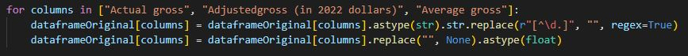

- As próximas colunas são as colunas Artists e Tour Title, colunas de texto que aconteceram erros de escrita devido ao processo de webscraping, iremos utilizar várias funções replace para substituir os textos errados por valores vazios, deixando assim o texto da coluna limpa. Veja o código abaixo:

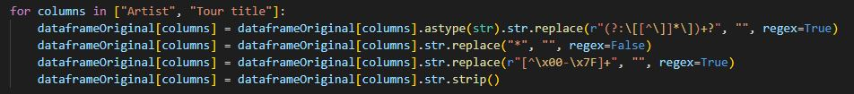

- A última coluna é a coluna Year, que dela iremos extrair duas datas, uma do início da turnê, e uma do fim da mesma. Para isso usamos a função extract para extrair essas datas e dividir elas em duas colunas diferentes (Start Year e End Year) e após isso utilizamos a função astype(int) para transformar as datas que antes eram uma string, em um número inteiro. Veja o código abaixo:

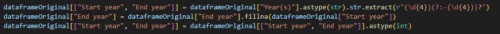

- Por fim, realizamos a seleção de todas essas colunas, agrupamos ela uma variável que seja agora o nosso dataframeLimpo, e exportamos esse csv resultante para a devida pasta. Veja o código abaixo:


Veja abaixo o antes e o depois do dataframe:

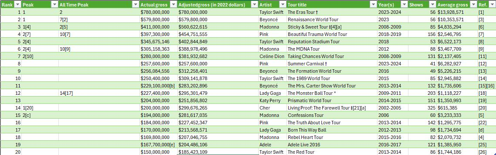
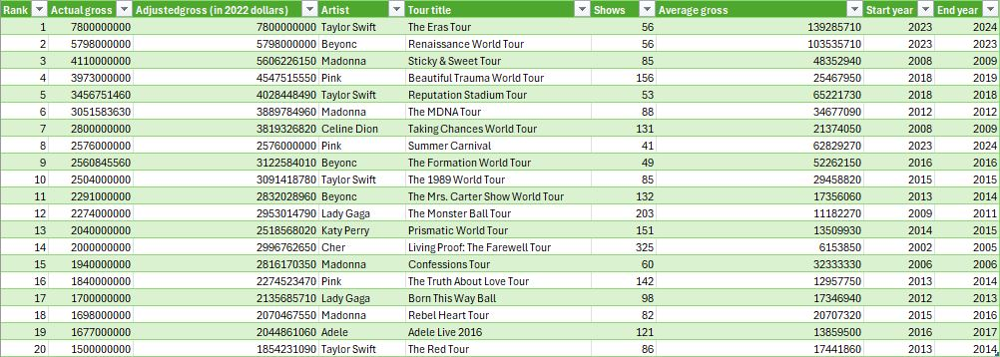

Com isso terminamos a Etapa 1 com a limpeza do nosso dataframe.

## Etapa 2 Processamento dos Dados

O objetivo da etapa 2 é utilizar o dataframeLimpo para processar e analisar os dados com o objetivo de gerar insights que respondam as perguntas abaixo:

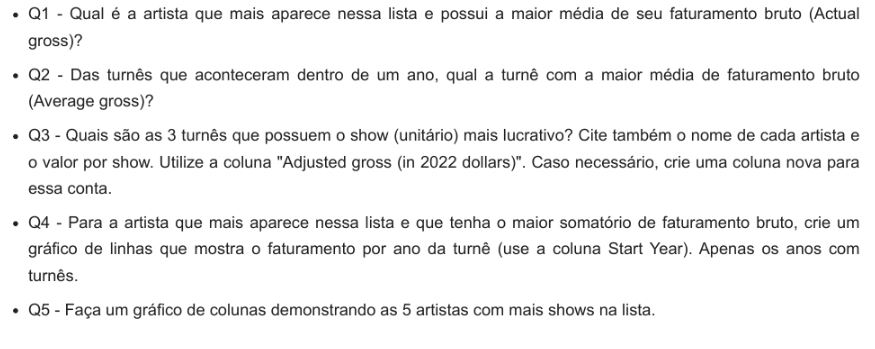

### Pergunta Q1

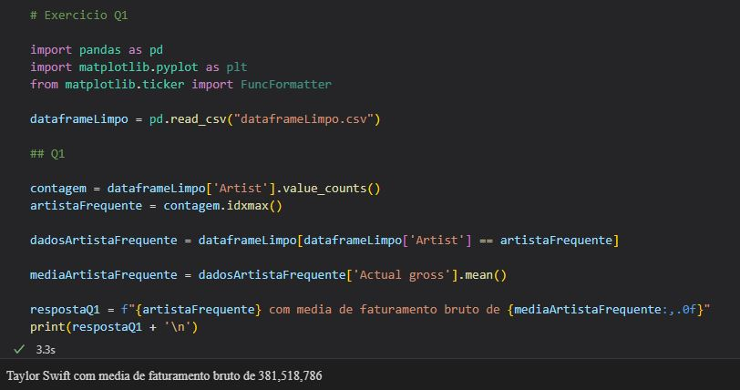

- Antes de iniciar o código importamos as bibliotecas que serão necessárias durante a resolução dos exercícios, e criamos uma variável dataFrameLimpo, que sera preenchido pela leitura do arquivo csv de mesmo nome. 

- O código se inicia com a criação de uma variável chamada contagem, que é preenchida por uma função value_counts, que verifica na coluna Artists do nosso dataframe, com essa contagem em mãos, utilizamos a fução idxmax para encontrar o ID do artista que mais aparece na lista, seus dados são armazenados em uma variável chama dadosartistaFrequente. 

- Com seus dados em mãos iremos na coluna Actual Gross executar a função mean, que irá ler todos os valores da coluna, e obter a média deles, armazenando esse valor resultante em uma variável chamada mediaArtistaFrequente

- Por fim, printamos na tela uma mensagem com o nome do artista mais frequente, e a média de seu Actual Gross. 

### Pergunta Q2

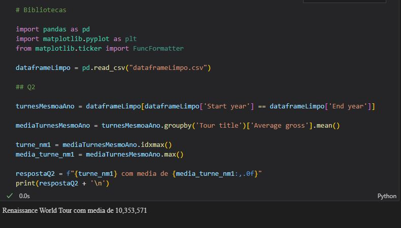

- O código se inicia fazendo uma comparação entre as colunas Start Year e End Year, as linhas que tiverem valores iguais nas duas colunas, serão exportadas para uma variável chamada turnesMesmoAno

- Com as turnes de mesmo ano já filtradas, iremos agrupar elas pelo Título e pela média de seus Average Gross, armazendo o resultado em uma variável chamada mediaTurnesMesmoAno

- Dessa variável utilizamos a mesma função idxmax e max, para filtrar pelo ID, o nome da turnê com a maior média do dataframe

- Com essas duas informações, printamos na tela o nome da turnê e a média dela. 

### Pergunta Q3

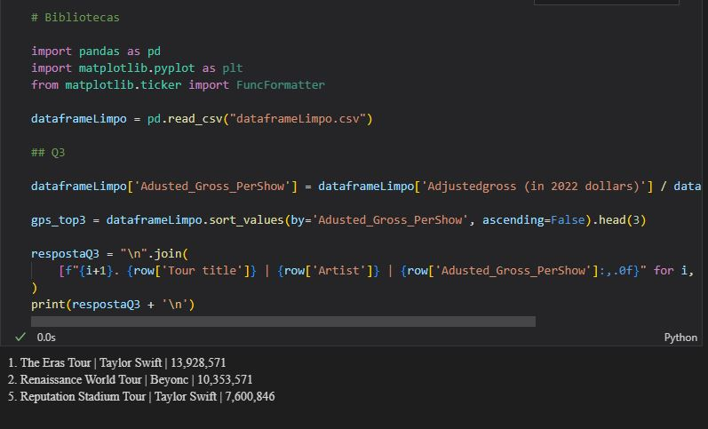

- Iniciamos criando uma nova coluna no nosso dataframe, resultado da divisão entre a coluna AdjustedGross pela coluna Shows (coluna que tem a quantidade de shows realizadas durante a turnê).

- Com essa coluna criada, realizamos por ela uma ordenação decrescente limitada a 3 linhas, com o objetivos de encontrar os dados das 3 turnês com maiore receita por show durante a turnê.

- Com os dados das turnês em mãos, imprimimos na tela o nome da turnê, o nome da artista, e o valor por show obtido. 


### Exportação Para TXT


- Após a execuçao das três primeiras questões, exportar o resultado delas para um mesmo arquivo txt chamado respostas.txt

- As duas próximas questões terão saídas gráficas, logo, não serão armazenadas junto ao arquivo. 

### Pergunta Q4

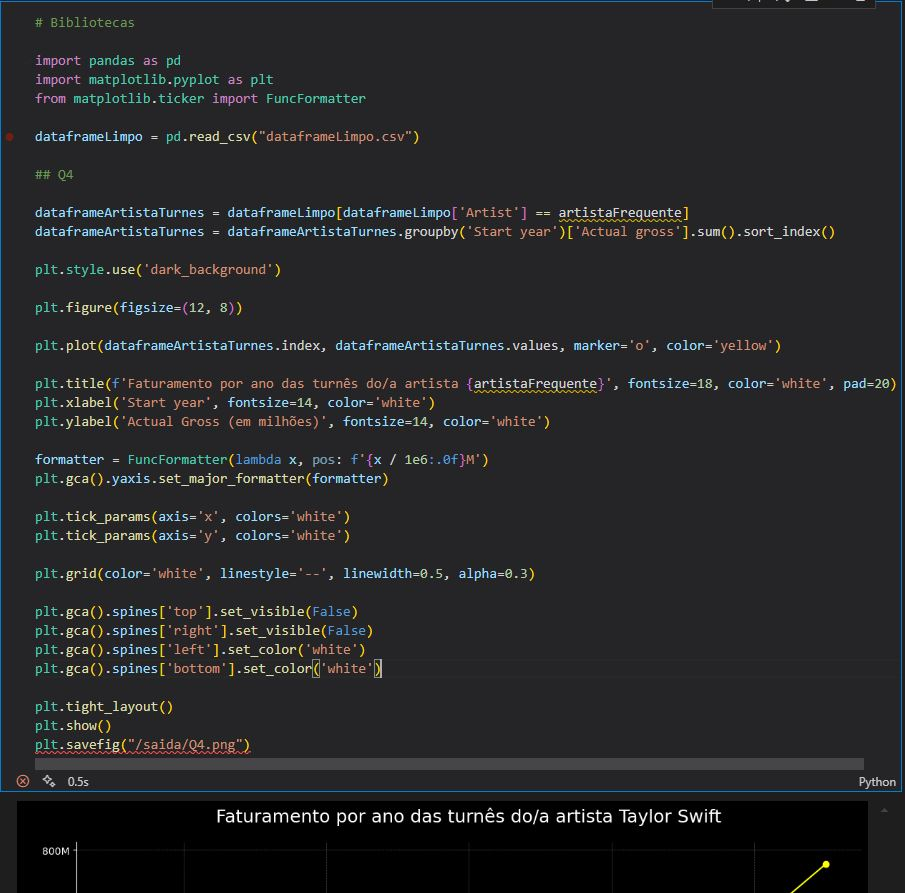

- O código se inicia com a filtragem do dataframe pela coluna artista, que procure linhas que correspondam ao nome da artista mais frequente, variavel criada no exercício Q1.

- Com todos as linhas de shows que possuem o nome dessa artista, é realizado um agrupamento da coluna Start Year e Actual Gross, onde a média dos shows em cada ano é calculada, e armazenada na variável dataframeArtistaTurnes

- Com essa média de Faturamente por Ano, realizamos a construção de um gráfico de linha com a evolução de receitas com turnês por ano da artista, veja o gráfico abaixo:

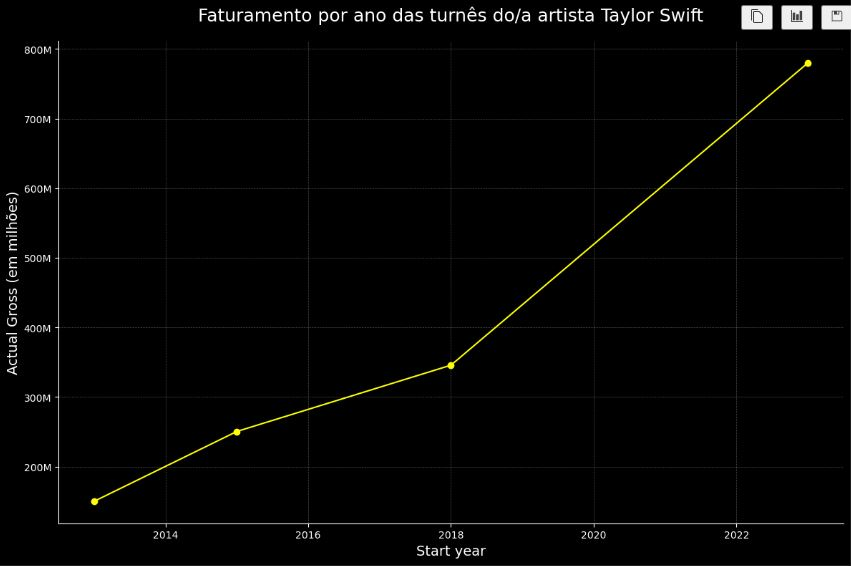

### Pergunta Q5 

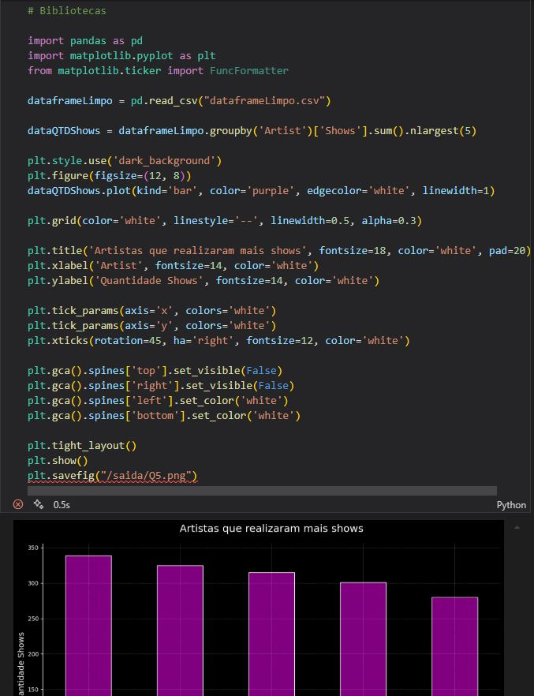

- O código se inicia com o agrupamento do dataframe pelas colunas Artists e Shows, onde nelas são aplicadas as funções sum para somar os shows pelo nome do artista, e a função nlargest, que filtra os 5 artistas com mais shows realizados dentro do período que engloba o dataframe 

- Com esse dados, é criado um gráfico de barras demonstrando os cinco artistas que executaram mais shows, pelo range de nosso dataframe, veja o gráfico abaixo: 

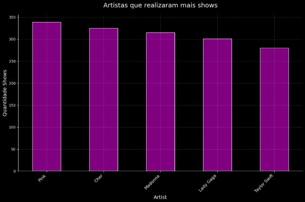

Com isso terminamos a etapa 2 com a resolução das cinco questões.

## Etapa 3 Dockerfile da Etapa1 

O objetivo da etapa 3 é o de criar uma imagem a partir de um arquivo de instruções Dockerfile que execute o arquivo elt.py, criado na Etapa1, gerando assim um conteiner a partir dessa imagem, os códigos DockerFile e etl.py podem ser encontrados abaixo:

[etl.py.](../Desafio/ETL/appETL/etl.py) 

[dockerfileETL.](../Desafio/ETL/Dockerfile)

- Primeiro passo: construi a nossa imagem, para isso, iremos ir até a pasta ETL e de lá, executar o comando:

```docker
 docker build image -t image_etl . 
```


- Se tudo der certo como na imagem acima, ao ir no Docker Desktop poderemos confirmar se a imagem foi ou não criada.

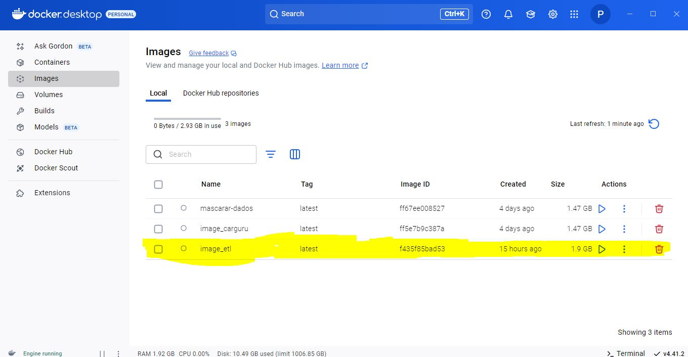

- Com a nossa imagem criada, agora temos que criar um conteiner que a partir dessa imagem, para rodar o script do nosso arquivo Python, para isso, utilizamos o comando:

```Docker
docker run -it image_etl
```


- Se tudo der certo, como podemos ver na imagem acima, o nosso script python foi executado corretamente, ao ir no Docker Desktop podemos ver também o conteiner criado, e suas informações.

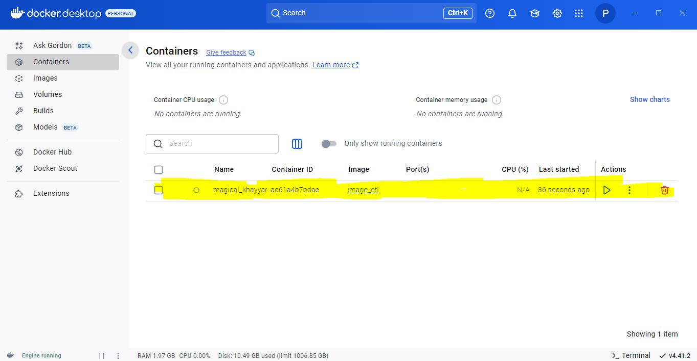

Com essa confirmação via Docker Desktop, finalizamos a etapa 3 com a criação de um dockerfile que executasse o script da etapa 1.

## Etapa 4 Dockerfile da Etapa 2

O objetivo da etapa 4 é o de criar uma imagem a partir de um arquivo de instruções Dockerfile que execute o arquivo job.py, criado na Etapa2, gerando assim um conteiner a partir dessa imagem, os códigos DockerFile e job.py podem ser encontrados abaixo:

[job.py.](../Desafio/JOB/appJOB/job.py) 

[dockerfileJOB.](../Desafio/JOB/Dockerfile)

- Primeiro passo: construi a nossa imagem, para isso, iremos ir até a pasta JOB e de lá, executar o comando:

```docker
 docker build image -t image_job . 
```


- Se tudo der certo como na imagem acima, ao ir no Docker Desktop poderemos confirmar se a imagem foi ou não criada.

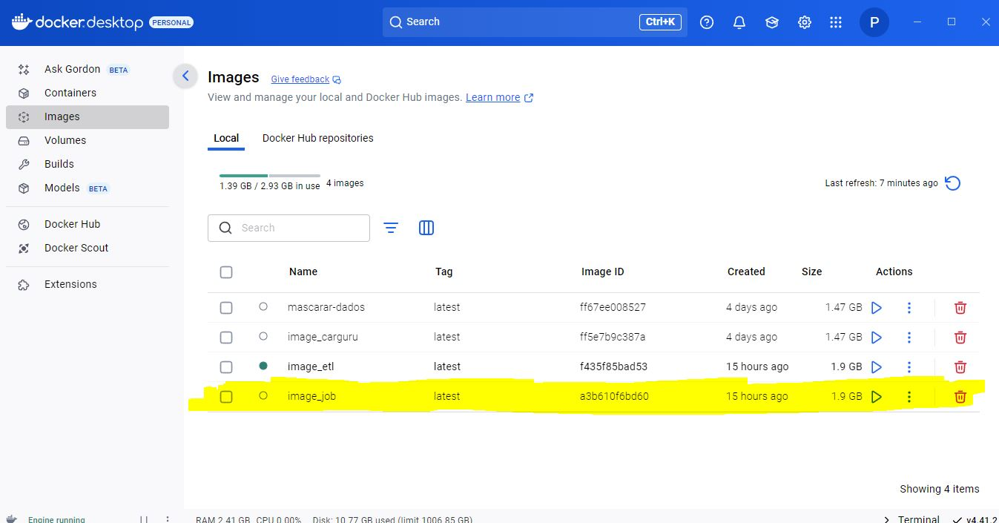

- Com a nossa imagem criada, agora temos que criar um conteiner que a partir dessa imagem, para rodar o script do nosso arquivo Python, para isso, utilizamos o comando:

```Docker
docker run -it image_job
```


- Se tudo der certo, como podemos ver na imagem acima, o nosso script python foi executado corretamente, ao ir no Docker Desktop podemos ver também o conteiner criado, e suas informações.

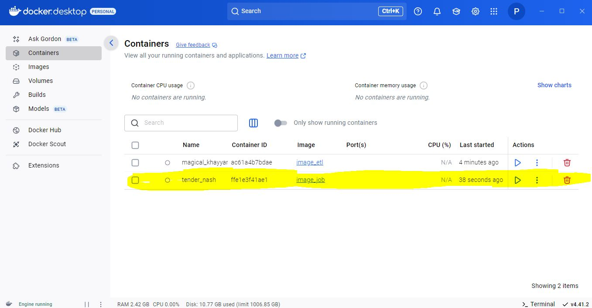

Com essa confirmação via Docker Desktop, finalizamos a etapa 4 com a criação de um dockerfile que executasse o script da etapa 2.

## Etapa 5 DockerCompose

- O objetivo da Etapa 5 é criar um arquivo DockerCompose que fosse capaz de executar os dois arquivos Dockerfile juntos de uma vez e armazenar as saídas desses scrips (respostas.txt, gráficos, dataframeLimpo) em uma única pasta chamada volume.

- O código do arquivo docker-compose, pode ser encontrado aqui:

[DockerCompose](../Evidencias/Desafio/Etapa5/Dockerfile_Compose.JPG)

- Primeiro temos que construi a nossa imagem, para isso, iremos ir até a pasta Desafio e de lá, executar o comando:

```docker
 docker-compose up --build 
```

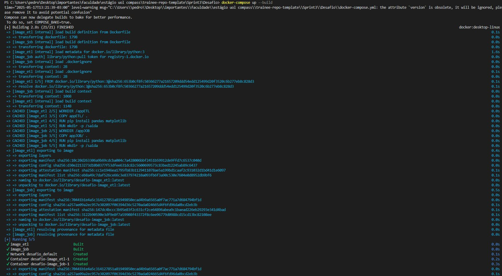

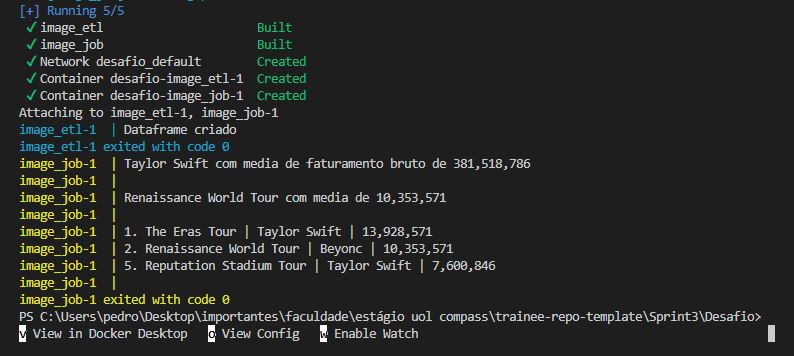

- Se tudo der certo como na imagem acima, com os dois dockerfile tendo saída positiva (valor zero), ao ir no Docker Desktop poderemos confirmar se a imagem foi ou não criada.

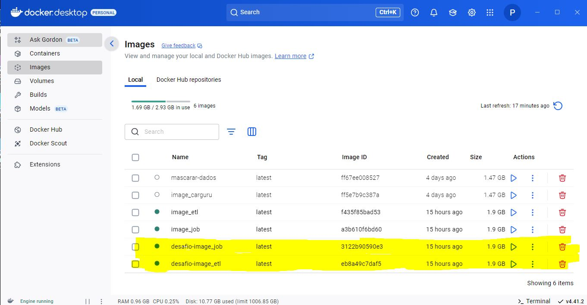

- Além disso, ainda dentro do DockerDesktop, podemos verificar a criação dos conteineres criados a partir da nossa imagem compose

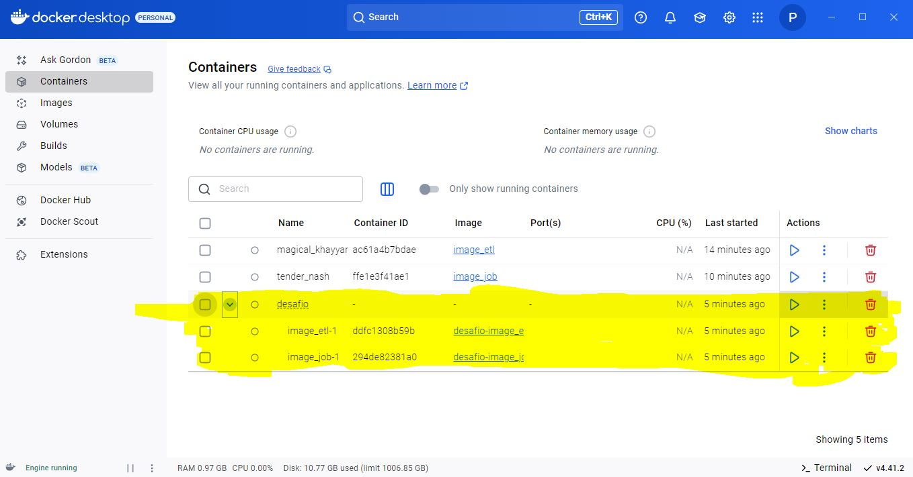

- Como tudo está certo no terminal e no DockerDesktop, basta verificar se foram criados a pasta volume, e se todas as saídas foram armazenadas na pasta

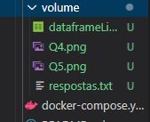


Com essa confirmação via Terminal, DockerDesktop e a pasta volume local, confirmamos que os arquivos Docker Compose foram configurados de forma correta, e a Etapa 5 (e juntamente o desafio ao todo) foram executados com sucesso.
