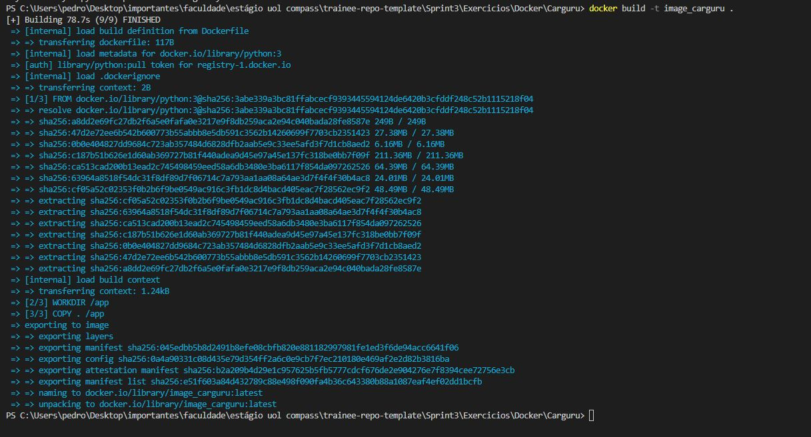
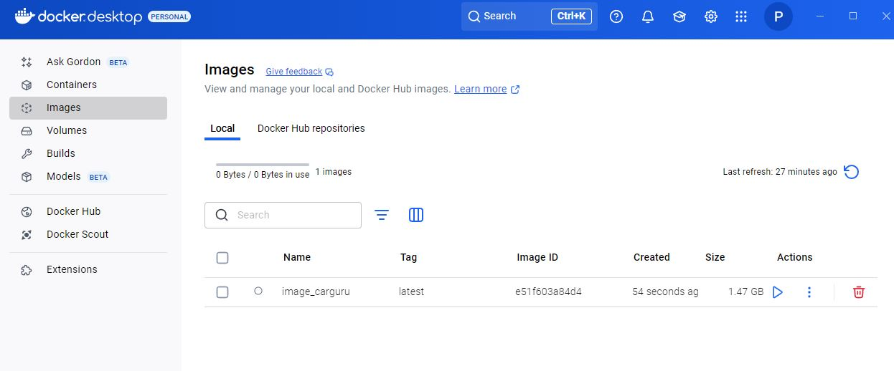
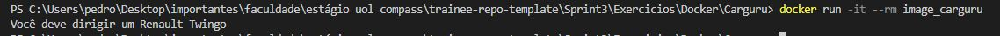
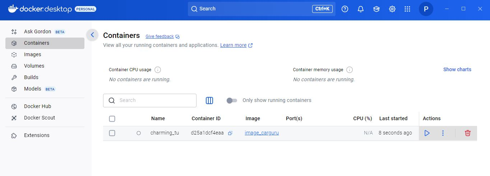
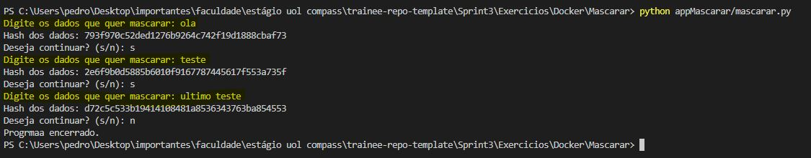
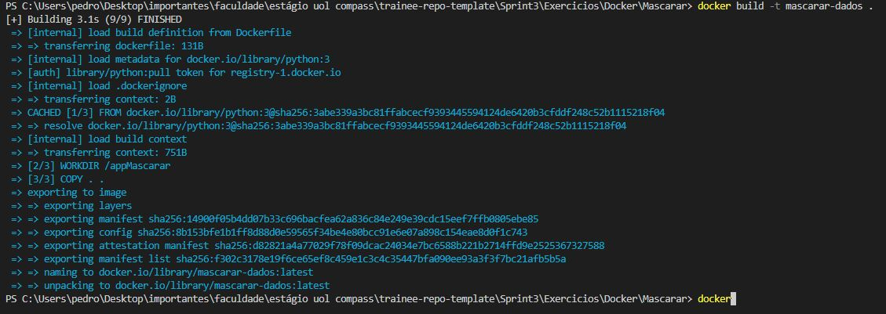
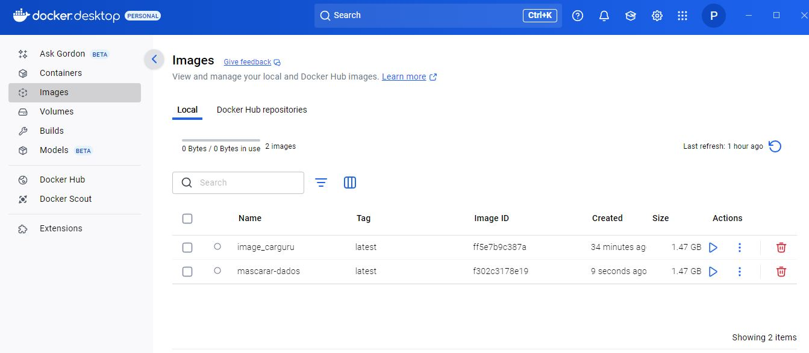
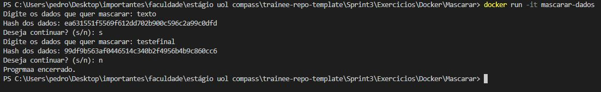
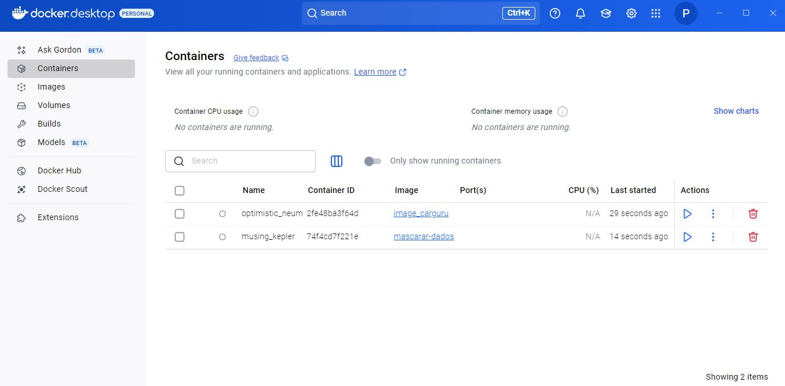

# Resumo

---

## Docker

- Na Seção 1 aprendi um pouco sobre as diferentes formas de instação do Docker e algumas discussões sobre o que é Docker, quais as diferenças entre um Conteiner e uma Imagem.

- Na Seção 2 a prática começa, aprendi sobre como construir um conteiner de forma iterativa ou em detached, como parar, reiniciar e remover um conteiner, verificar seus logs, suas portas, e como definir um nome para o mesmo.

- Na Seção 3 aprendi sobre construção de imagens, como escolher uma imagem via Docker Hub, rodar nossa imagem em um conteiner, nomear, parar, reiniciar e remover uma imagem, como construir imagem de processada, como inspecionar imagens, autenticá-las via terminal, e enviar ao Docker Hub.

- Na Seção 4 aprendi sobre volumes, como introduzir em um conteiner, volumes anônimos e nomeados, criar, listas, inspecionar, remover volumes.

- Na Seção 5 aprendi sobre Networks, tipos de conexão, driver, uso do Postman, conectar e desconectar um conteiner em uma rede, local ou não.

- Na Seção 6 aprendi sobre YAML, espaçamento, identação, diferentes tipos de valores (strings, booleanos, listas, dicionarios, nulos, numéricos) dentro de um arquivo YAML, além e como comentá-los.

- Na Seção 7 aprendi sobre gerenciar conteineres diferentes utilizando docker-compose, como utilizar seus serviços, criar, rodar, remover, linkas conteineres pela rede, e cuidar de suas variáveis e das builds de suas imagens.

- Na Seção 8 aprendi sobre Docker Swarm, seus conceitos, orquestração, como subir serviços, dentre outros.

- Na Seção 9 aprendi sobre Kubernetes, conceitos, orquestração, dependências, Deployment com MiniKubes, pods e modo declarativo.

# Exercícios

## Carguru

1. ...
[Codigo Py Carguru.](./Exercicios/Docker/Carguru/appCarguru/carguru.py)
[DockerFile Carguru](./Exercicios/Docker/Carguru/Dockerfile)

## Mascarar

1. ...
[Codigo Py Mascarar.](./Exercicios/Docker/Mascarar/appMascarar/mascarar.py)
[DockerFile Mascarar](./Exercicios/Docker/Mascarar/Dockerfile)

# Evidências

## Carguru

O exercício se inicia na etapa 1, com o objetivo de criar uma imagem a partir de um arquivo de instruções Dockerfile que execute o arquivo Carguru.py, gerando assim um conteiner a partir dessa imagem, os códigos DockerFile e Carguru.Py podem ser encontrados na Seção de Exercícios logo acima.

- Primeiro passo: construi a nossa imagem, para isso, iremos ir até a pasta Carguru e de lá, executar o comando:

```docker
 docker build image -t image_carguru . 
```



- Se tudo der certo como na imagem acima, ao ir no Docker Desktop poderemos confirmar se a imagem foi ou não criada.



- Com a nossa imagem criada, agora temos que criar um conteiner que a partir dessa imagem, para rodar o script do nosso arquivo Python, para isso, utilizamos o comando:

```Docker
docker run -it image_carguru
```



- Se tudo der certo, como podemos ver na imagem acima, o nosso script python foi executado corretamente, ao ir no Docker Desktop podemos ver também o conteiner criado, e suas informações.



Com essa confirmação via Docker Desktop, finalizamos a etapa 1 dos nossos exercícios com Docker.

## Mascarar

O exercício com Docker na etapa 2 tem o objetivo de criar um conteiner a partir de uma imagem, mas ele tem que permitir o recebimento de inputs pelo usuário

- Primeiro passo é criar nosso arquivo, o arquivo python da vez se chama mascarar.py, e com ele, iremos inserir strings para passarem por um processo de hash, sendo transformadas em dados de tamanho variável, para dados de tamanho fixo, os códigos DockerFile e Mascarar.py podem ser encontrados na Seção de Exercícios logo acima.

Abaixo, a prova do êxito do nosso arquivo mascarar.py, tranformando os dados:



- Com nosso arquivo criado, temos que realizar os mesmos comandos do exercício Carguru, primeiro construir nossa imagem:

```Docker
docker build -t image_mascarar .
```



- Se tudo der certo como na imagem acima, ao ir no Docker Desktop poderemos confirmar se a imagem foi ou não criada.



- Com a nossa imagem criada, agora temos que criar um conteiner que a partir dessa imagem, para rodar o script do nosso arquivo Python, para isso, utilizamos o comando:

```Docker
docker run -it image_mascarar
```



- Se tudo der certo, como podemos ver na imagem acima, o nosso script python foi executado corretamente, os dados foram inseridos pelo input, e retornados após o hash, logo, ao ir no Docker Desktop podemos ver também o conteiner criado, e suas informações.



Com essa confirmação via Docker Desktop, finalizamos a etapa 2 dos nossos exercícios com Docker.

# Certificados


