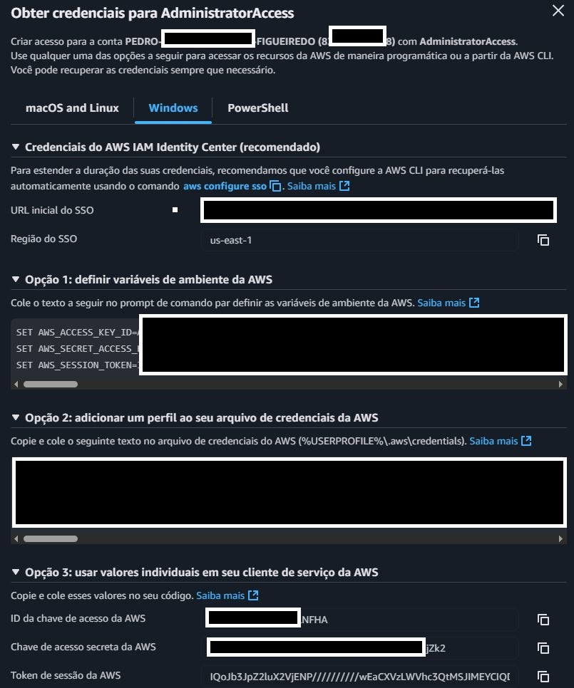
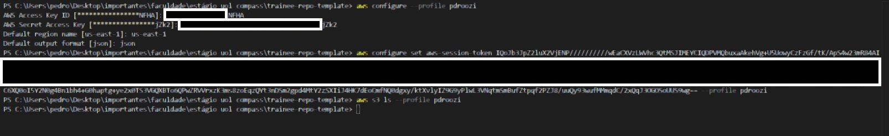

# Desafio

---

## Etapa 1

O objetivo da Etapa1 do Desafio era realizar um código em Python utilizando a biblioteca boto3 para realizar a conexão com a conta AWS, realizar a criação de um bucket, e dentro dele, fazer o upload do arquivo CSV que iremos usar para análises posteriores

O arquivo Jupyter desta etapa pode ser acesso por aqui:

[JupyterEtapa1](../Desafio/Etapa1/etapa1.ipynb)  <--

- Para começar a Etapa, é necessário configurar no nosso terminal as chaves de acesso da conta AWS que iremos usar, para realizar a conexão, para isso, acessamos nossa conta AWS e clicamos na seção "Chaves de Acesso"

**Observação**: Chaves de Acesso da AWS são temporárias e são geradas toda vez que clicamos na seção, logo, é importante manter a janela da seção de Chaves de Acesso aberta, pois ao fechá-la, as chaves são desativadas

- Com a seção aberta, iremos utilizar a terceira opção de acesso à conta, que nos fornece de forma separada a ID da Chave, a Chave Secreta e o Token de Acesso, além disso iremos usar a região do SSO (us-east-1)

- Com as chaves em mãos, abrimos nosso terminal windows, ou no meu caso, um terminal no VSCode e utilizamos o seguinte comando para criar um perfil ("pdroozi") e dedicar à ele essas chaves, quando formos realizar a conexão, é só referenciar o perfil, e assim, conseguimos extrair as chaves de forma automática

- Com o perfil configurado, e a chave sincronizada à ele, podemos partir para o código

- O código se inicia com a importação da biblioteca boto3, previamente instalada pelo terminal usando um "pip install boto3"

- Nesse momento algumas variáveis que serão frequentes durante o desafio são criadas:

  - A "session", que utiliza o boto3 para se conectar ao perfil criado anteriormente

  - O "s3_cliente", que cria uma conexão do nosso perfil cliente que possui as chaves de acesso da conta (pdroozi) com a ferramenta que queremos trabalhar ("s3")

  - O "bucket-name", que contém o nome do nosso bucket que será criado - e posteriormente referenciado - no nosso S3

  - O "file_name", que possui o nome do arquivo CSV que iremos fazer o upload nessa etapa após a criação do bucket

  - O "local_path", que é o caminho para acessar o nosso arquivo CSV, que nesse caso, temos que subir um nível na organização de pasta, ir na subpasta data, e dentro dela, acessar o arquivo buscado "ProUniTrienio.csv"

- O s3_cliente, usa a função create.bucket do boto3, usando a variavel bucket_name e cria dentro do S3 da nossa conta (que estava vazio), um bucket novo

- Pra finalizar a Etapa1, o upload do arquivo CSV é feito utilizando a função upload.file do boto3, usando as variaveis local_path (para encontrar o arquivo), bucket_name (nome do bucket aonde será inserido o arquivo) e file_name (o nome que o arquivo terá no bucket, que no caso, será o mesmo, mas pode ser diferente se assim desejar)

Assim, concluímos a Etapa1, nosso bucket foi criado, e tem como único objeto no momento, o arquivo CSV que utilizaremos na etapa posterior.

## Etapa 2

O objetivo da Etapa2 do Desafio é realizar um código em python, que utilizando a biblioteca boto3, leia os dados do arquivo CSV que se localiza dentro do bucket no S3 da nossa conta AWS. Assim, realizaremos três análises com esses dados, e o resultado delas (seja um csv, um gráfico) deve ser inserido de volta dentro do bucket

Antes de iniciar as análises, iremos montar a estrutura de um código que será usada em todas as análises, voltado à leitura do arquivo CSV, e normalização dos dados, ela é composta por:

- Bibliotecas:

  - Boto3 para conexão com a AWS
  - AwsWrangler para leitura dos dados pelo S3
  - Pandas para manipulação dos dados
  - MatPlotLib para visualição dos dados por gráficos
  - UnicodeData para normalização dos dados com retirada de acentos e outros caracteres especiais

- A "session", que utiliza o boto3 para se conectar ao perfil criado anteriormente

- O "s3_cliente", que cria uma conexão do nosso perfil cliente que possui as chaves de acesso da conta (pdroozi) com a ferramenta que queremos trabalhar ("s3")

- O "bucket-name", que contém o nome do nosso bucket que será criado - e posteriormente referenciado - no nosso S3

- O "file_name", que possui o nome do arquivo CSV que iremos fazer o upload nessa etapa após a criação do bucket

- O "local_path", que é o caminho para acessar o nosso arquivo CSV, que nesse caso, temos que subir um nível na organização de pasta, ir na subpasta data, e dentro dela, acessar o arquivo buscado "ProUniTrienio.csv"

- O "file_path_s3" que é o caminho para acessar o arquivo csv dentro do bucket

- O "df" que é o dataframe criado pela função read.csv que utiliza as variáveis **file_path_s3** e **session** para ler o arquivo CSV dentro do bucket e gerar um dataframe que é armazenado na variável

- O "df.columns" que utiliza a biblioteca **unicode** para retirar todos os caracteres especiais dentro do formado **NFKD**, utiliza a função **upper** para padronizar todas as colunas em maiúsculo, e **strip** para tirar todos os espaços vazios nas extremidados, facilitando a consulta

### Teste

- Código usado de teste para a conexão com o AWS, fazendo uma consulta simples ao dataframe puxando o head do csv, ou seja, as 5 primeiras linhas

### Análise 1 - Geográfica

- É usado a função **value_counts** na coluna "região_beneficiario_bolsa para fazer somar a quantidade de ocorrências do nome de cada região na coluna

- O plot usado é o pie (torta)

- A função savefig é chamada para salvar os arquivos resultantes (um CSV e um PNG) localmente

- A função boto3 **upload_file** é chamada para fazer o upload no bucket dos dois arquivos resultantes da Análise 1

- Podemos entender pelo resultado da análise que o Sudeste concentra quase metade do destino das bolsas, talvez evidenciando uma desigualdade regional no acesso ao Prouni com Norte e Centro-Oeste sendo subrepresentados, mesmo considerando população

- Pra aprofundar a análise, seria interessante correlacionar com outros dataframes, com a população de cada região, número de instituições privadas e públicas, até mesmo o PIB/RendaMédia da região

Acesse aqui os outputs da Análise:

- [CSVAnali1](../Desafio/saida/distribuicao_bolsas_por_regiao_trienio.csv)

- [PNGAnali1](../Desafio/saida/distribuicao_bolsas_por_regiao_trienio.png)

### Análise 2 - Social / Etária

- Cria uma função que recebe uma variável idade do tipo int que é agrupada em subgrupos de acordo com condições

- É usado a função datetime na coluna "nascimento_beneficiario_bolsa" para coletar apenas o ano em que o bolsista nasceu

-Para descobrir a idade do bolsista no ano em que recebeu a bolsa, temos que criar uma coluna chamada "faixa etaria" que ela é o resultado da subtração entre o ano em que a pessoa recebeu a bolsa (2017, 2018 ou 2019) e o ano de nascimento dela

- Essa coluna resultante é aplicada na função criada anteriormente, e os resultados são agrupados em diferentes grupos

- o Dataframe é agrupado pelas colunas do ano de concessão da bolsa, e a coluna recém criada

- Um plot de barras é utilizado nessa análise

- A função savefig é chamada para salvar os arquivos resultantes (um CSV e um PNG) localmente

- A função boto3 **upload_file** é chamada para fazer o upload no bucket dos dois arquivos resultantes da Análise 2

- Podemos entender pelo resultado da Análise 2 que o programa é grandemente dedicado à jovens recém-saídos do ensino médio e recém adultos no início da faculdade

- O valor significativo de pessoas acima de 25 e 30 anos msotra que o programa também têm a inclusão de pessoas mais velhas que querem e estão podendo retornar aos estudos

- [CSVAnali2](../Desafio/saida/distribuicao_bolsas_por_faixa_etaria_trienio.csv)

- [PNGAnali2](../Desafio/saida/distribuicao_bolsas_por_faixa_etaria_trienio.png)

### Análise 3 - Demográfica

- É criado um dataframe que recebe o agrupamento via função **groupby** da coluna de ano de concessão da bolsa e raça do beneficiário

- O plot usado é o de linhas

- A função savefig é chamada para salvar os arquivos resultantes (um CSV e um PNG) localmente

- A função boto3 **upload_file** é chamada para fazer o upload no bucket dos dois arquivos resultantes da Análise 3

- Podemos entende pelo resultado da Análise 3 que existem tendências raciais no acesso ao ProUni, com um pouco aumento da inclusão racial de grupos históricamente marginalizados (como pretos, pardos e indígenas) no programa

- Com o aumento de grupos marginalizados e a diminuição da adoção de Brancos ao programa, pode-se inferir um movimento do governo de aumento da equidade racianl no acesso ao ensino superior, com políticas afirmativas que por esses dados, parecem estar surgindo efeito

- [CSVAnali3](../Desafio/saida/distribuicao_bolsas_por_raca_trienio.csv)

- [PNGAnali3](../Desafio/saida/distribuicao_bolsas_por_raca_trienio.png)
