# Desafio

---

## Alguns questionamentos que buscamos responder

- Orçamento médio e receita das obras de Greta Gerwig ao longo dos anos (filmes ficaram mais caros de se produzir?)

- Filmes mais bem avaliados pelo público e crítica (filmes polarizadores?)

- Popularidade e frequência dos atores e diretores que Greta já trabalhou (tem relação com as obras mais bem avaliadas pela crítica/público, ou com o orçamento?)

- Companhias que mais estiveram presentes na carreira de Greta e sua nacionalidade (Ela atua mais com produtores nacionais ou internacionais? Quanto cada companhia teve de gasto e receita com filmes envolvendo a Greta? Quais lucraram?)

- Durante sua carreira no gênero, tem mais presença como atriz? Diretora? Roteirista? Escritora?

## Etapa1

- Acesse por aqui, os arquivos Python e Dockerfile entregáveis da Etapa1

[DockerFileEtapa1](../Desafio/Etapa1/Dockerfile)

[ArquivoPythonEtapa1](../Desafio/Etapa1/appCSV/uploadCSVs.py)

- A Etapa1 do Desafio tem por objetivo realizar a implementação de um arquivo python que leia dois arquivos CSVs baixados, de forma inteira, e os insira em um Bucket S3 utilizando Boto3, na camada RAW Zone, seguinto o padrão estabelecido:

(<nome do bucket>\<camada de armazenamento>\<origem do dado>\<formato do dado>\<especificação do dado>\<data de processamento separada por ano\mes\dia>\<arquivo>)

ou

S3:\\data-lake-do-fulano Raw\Local\CSV\Movies\2824\05\02\movies.csv

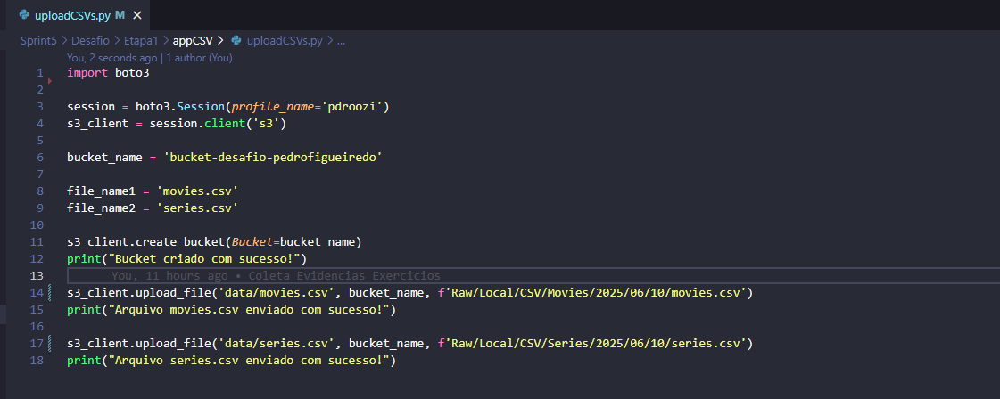

- O código se inicia com a importação da biblioteca boto3, e a definiçãde algumas variáveis, são elas:

  - session: sessão do boto3 que armazena as chaves de acesso da conta AWS, gravadas no perfil pdroozi criado na Sprint passada
  - s3_client: cliente criado utilizando a variável sessão que cria uma linha de conexão do perfil com o serviço escolhido, no caso, o S3
  - bucket-name: nome do bucket que será criado na AWS
  - file_name (1 e 2): nome dos arquivos que serão upados para dentro do bucket, no caso, os dois arquivos CSV ("movies" e "series")

- É usada a função create_bucket, que utiliza o bucket-name como parâmetro, e retorna, em caso de sucesso, uma mensagem de confirmação sobre a crição do bucket na AWS

- É usada duas funções upload_file, uma para cada arquivo CSV, que utiliza como parâmetro o caminho para acessar os arquivos na máquina local, o nome do bucket para onde serão armazenados, e o caminho onde eles serão armazenados dentro do bucket, no caso, iremos seguir o padrão estabelecido acima

- Com a criação do arquivo Python, temos agora que criar um arquivo Dockerfile, que irá criar uma imagem desse nosso arquivo Python, e gerar um container, onde iremos rodá-lo, executando assim, o upload dos arquivos, o arquivo Dockerfile, pode ser acesso pelo link já fornecido acima

- Com o Dockerfile criado, temos que iniciar a crição da nossa imagem, utilizando o comando docker build, e confirmar via terminal e DockerDesktop se foi criada corretamente

``
docker build image_app_csv
``

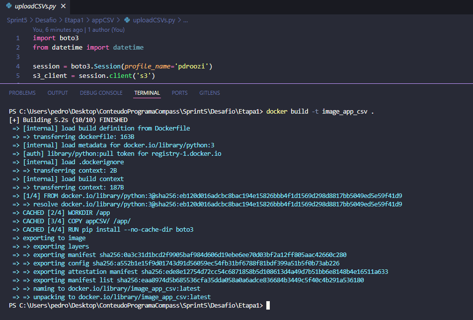

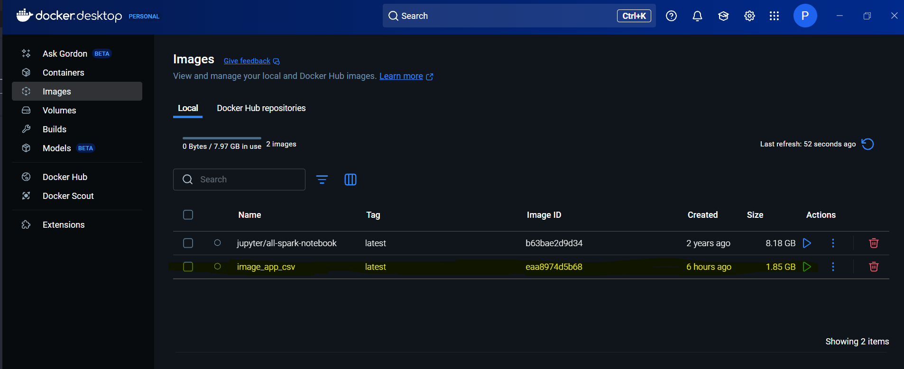

- Com a imagem criada, podemos executá-la, porém, é necessário algumas preparações antes, primeiro temos que criar dois volumes, um deles para armazenar os arquivos CSV que iremos utilizar para realizar o upload, e o segundo, para armazenar o arquivo .aws com as chaves de acesso da AWS que iremos utilizar, já que sem elas, dentro do container, não é possível acessar as chaves pelo aws profile

- Com os volumes estabelecidos, podemos executar nossa imagem, confirmar a execução dela via terminal (esperado o aparecimento das mensagens de confirmação já citadas), via DockerDesktop

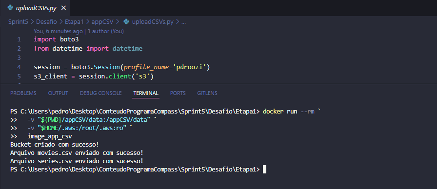

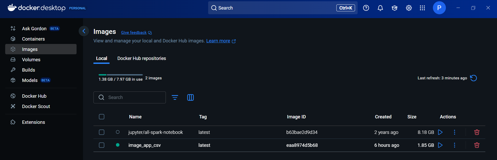

- Podemos então, ir até nosso serviço S3, e confirmar a criação de um novo bucket, e o upload dos dois arquivos CSV

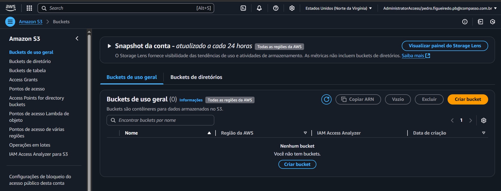

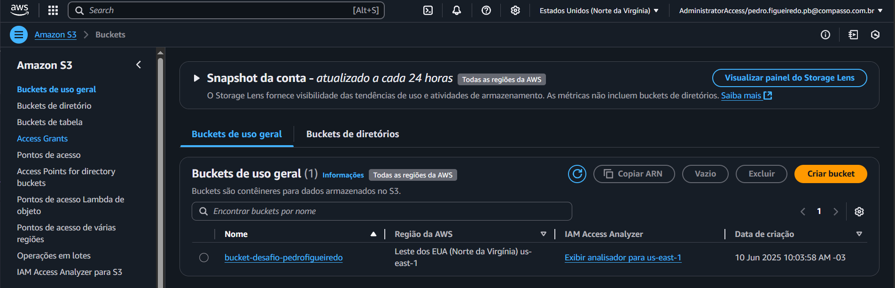

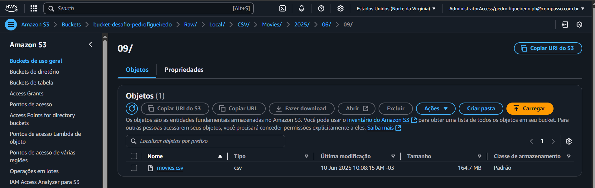

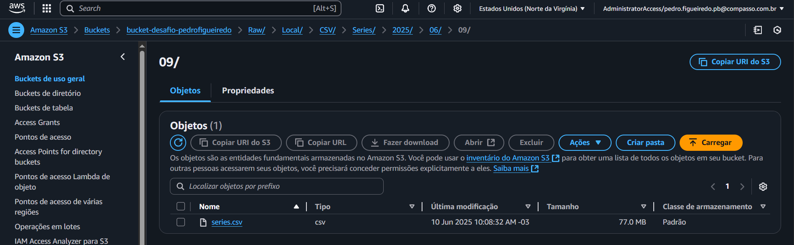

## Etapa2

- Acesse por aqui o código Python entregável da Etapa2

[processamentoData.py](../Desafio/Etapa2/appProcessamento/processamentoData.py)

O Desafio consistem em construir um código em Python com boto3 que, dentro da ferramenta AWS Lambda, realiza a leitura dos dados do arquivo CSV (ou movies, ou series) escolhido, e utilizando as APIs escolhidas (no nosso caso, API do TMDB e do IMDB) coletar dados complementares aos do CSV com o objetivo de responder às perguntas elaboradas, relacionando elas aos resultados obtidos, que deverão ser em formato JSON, e devem ser exportados de volta para o bucket s3 na Etapa1, utilizando o caminho padronizado já pré-estabelecido, segue:

(<nome do bucket>\<camada de armazenamento>\<origem do dado>\<formato do dado>\<especificação do dado>\<data de processamento separada por ano\mes\dia>\<arquivo>)

ou

S3:\\data-lake-do-fulano\Raw\TMDB\JSON\2024\05\02\prt-uty-nfd.json

- O código se inicia com a importação das bibliotecas necessária:
  - json para manipulação de dados no formato JSOn
  - os para importação das chaves de ambiente, evitando assim a exposição das chaves no código
  - boto3 para leitura e gravação dos dados no S3
  - pandas para manipulação do CSV lido
  - requests para realizar as requisições das APIs a serem utilizadas
  - numpy para manipulação das listas de ids
  - BytesIO para filtrar as colunas do CSV
  
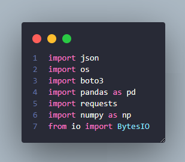

- A próxima parte é importar é definir as variáveis de ambiente (API Keys)

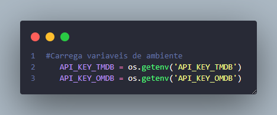

- A próxima parte é crias as listas que iremos utilizar

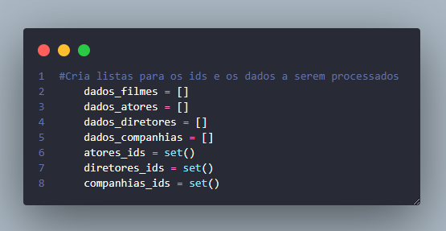

- Agora, criaremos a conexão com o serviço S3 usando um cliente, via Boto3, definindo o nome do nosso bucket, e o caminho para acessar o CSV de filmes armazenado

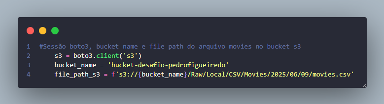

- Agora, iremos realizar a leitura do CSV dentro do bucket usando Boto3, realizar a criação de um dataframe com esse dados, filtrar pelo nome "Greta Gerwig" na coluna "nomeArtista", e todos as linhas (filmes) que corresponderem, iremos coletar os IDs (que estão no formato IMDB)

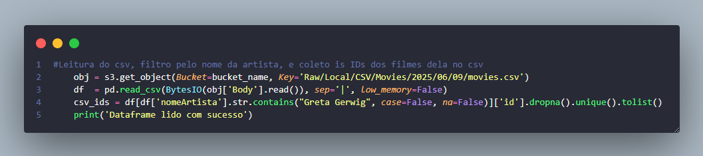

Com isso, a parte de extração dos dados do CSV está pronta, iremos agora partir pras requisições às APIs para coleta dos dados nos endpoints explorados

- Com o nome da Greta Gerwig, iremos no endpoint "person" no TMDB, e coletar a ID que representa a artista nesse DB

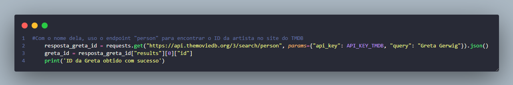

- Agora com o ID da artista, podemos fornecê-lo ao endpoint "movie_credits", para buscar todos os IDs dos filmes em que a artista teve alguma participação por qualquer função e armazená-los em uma lista "filmes_greta_tmbd_ids"

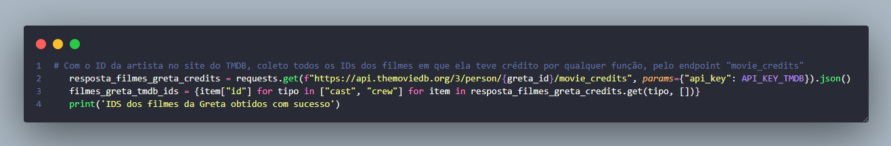

- Iremos pegar todos os IDs dos filmes estão no CSV (e que estão no formato IMDB), e os utilizeros no TMDB para encontrar os filmes a qual eles pertencem, por mais que o formato seja diferente, é possível utilizar ele pra pesquisar o filme correspondente através do endpoint "find", o resultado do filme é adicionado na lista de IDs criada no passo anterior

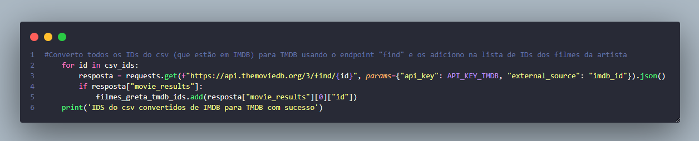

- Agora que a lista dos IDs de todos os filmes com participação da nossa artista está pronto, iremos através de um laço utilizá-los no endpoint "movie", para buscar todas as informações do filme disponíveis aqui no TMDB

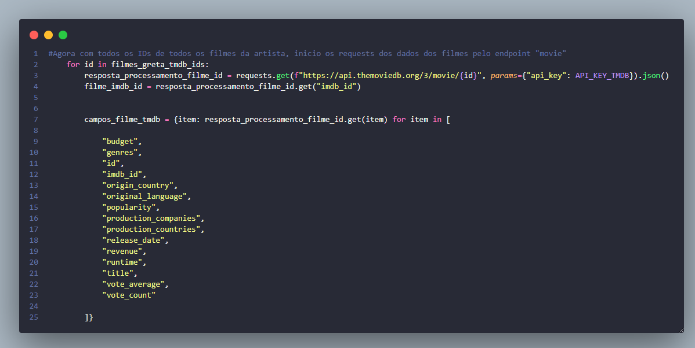

- Após coletar os dados complementares do TMDB, para cada um desses IDs, iremos ir até o endpoint do IMDB, e buscar outras informações complementares que o OMDB tem disponível

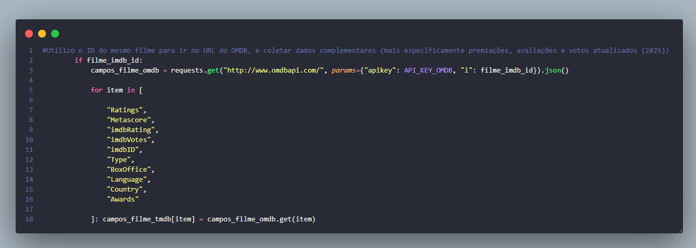

- Por fim, utilizo esse ID para ir ao endpoint "Credits", buscar os IDs dos três principais atores do filme, e do diretor, esses IDs, são armazenados nas listas criadas no início da Etapa2

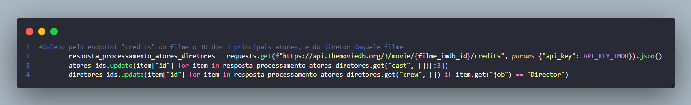

- Agora, fora do laço de filmes, e com as listas de IDs de diretores e atores pronta, iremos utilizar um outro laço For que vai percorrer as duas listas, e aplicar os IDs no endpoint "person", buscando assim, as informações completas dos atores e diretores de todos os filmes onde a Greta Gerwig teve alguma função

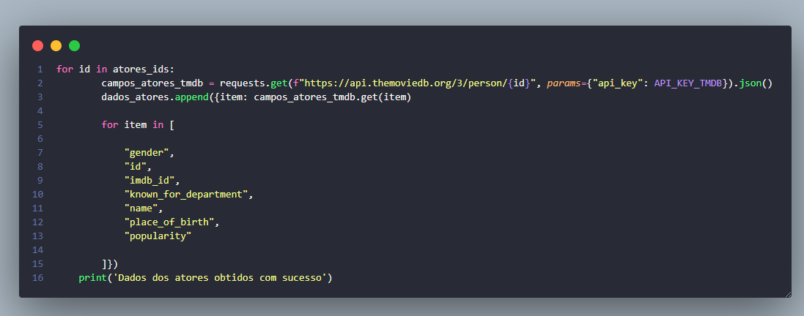

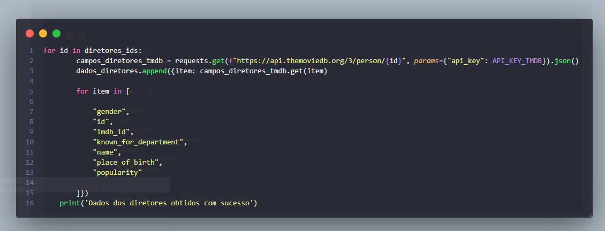

Assim terminados a parte de coleta de dados e requisições, com os JSONs criados, podemos partir para a parte de carregamento deles para dentro do bucket S3 criado

- Utilizaremos as funções boto3 "putObject" para cada um dos JSON, carregando eles para dentro do bucket s3 usando o nome do bucket e o caminho já especificado, como parâmetros da função

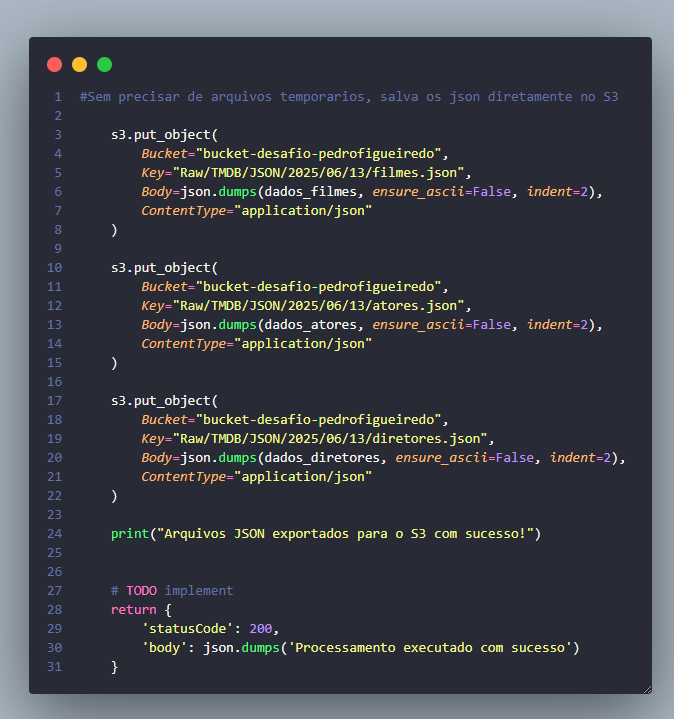

- Confirmamos o sucesso da operação com o retorno de um statusCode 200, e claro, com a verificação no bucket

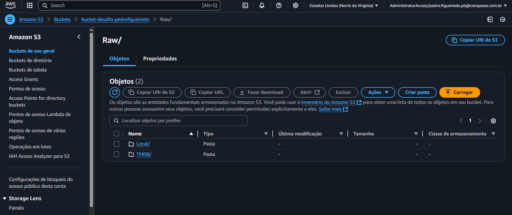

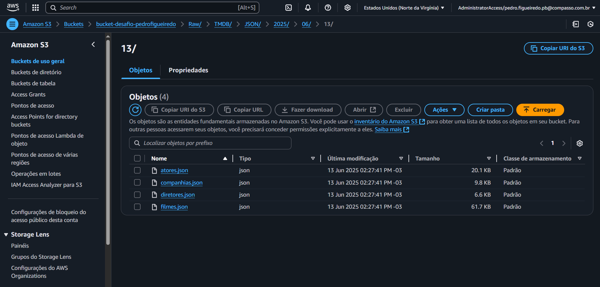

---
---
---

Demonstrarei a seguir as preparações do ambiente do Lambda para uso do código python:

- Primeiro, a criação de uma função lambda, chamada de myFuncionLambda

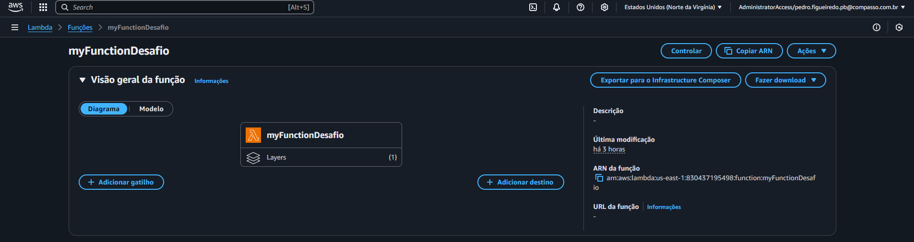

- Tive problemas com falta de memória, para funcionar, tive que ajustar as seguintes configurações

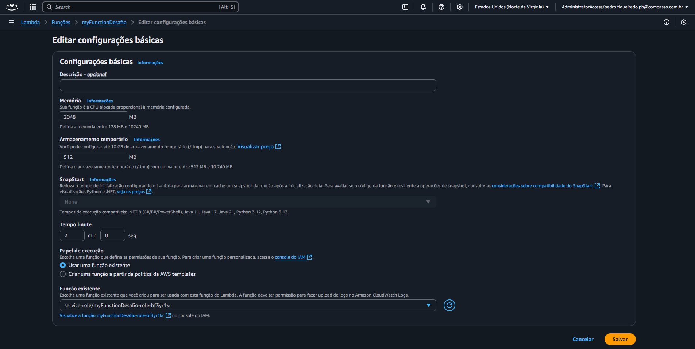

- O código deu erro, devido a falta da biblioteca pandas, que por padrão não existe no ambiente Lambda, a situação foi resolvida utilizando uma layer da AWS para a versão do Python 3.11 (minha versão), que contém a biblioteca

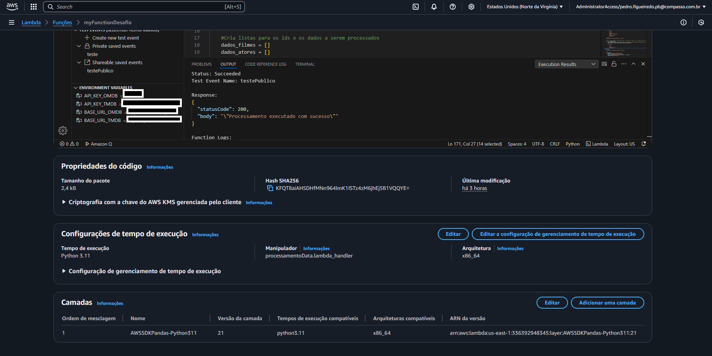

- Por fim, para utilizar as funções boto3 "getObject" e "puObject", com a orientação e permissão do monitor, realizei a criação de uma IAM Role, nela, dediquei as duas permissões necessárias, e apliquei e vinculei a Role à nossa função do Lambda

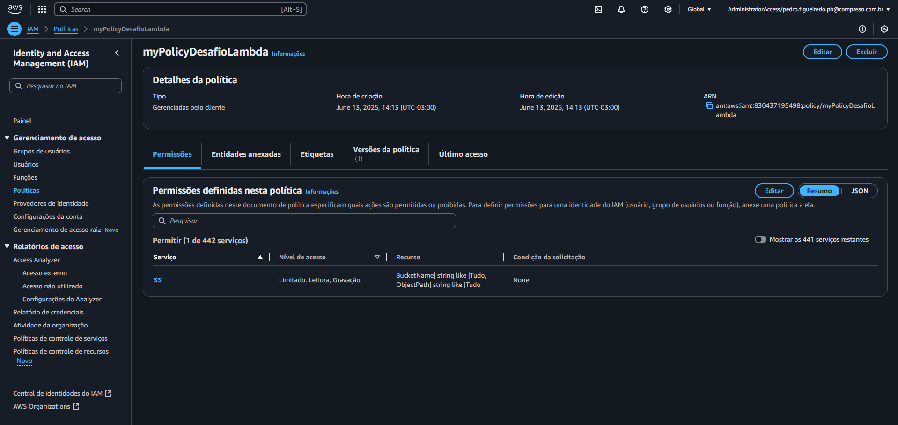

- Com tudo correto, dentro do ambiente do Lambda, o código foi inserio, um evento de teste foi criado, e o retorno do StatusCode200, foi então confirmado

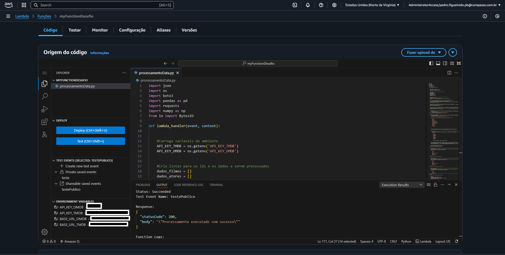
