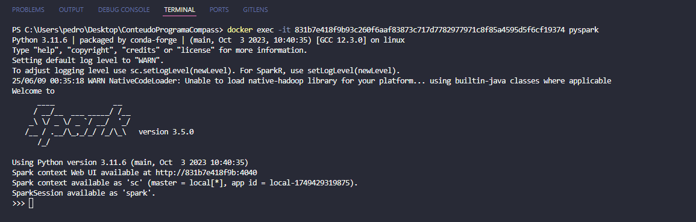

# Resumo

## PySpark

- No Módulo 3, aprendi sobre Dataframes e RDDs, principais ações e transformações com eles, exportanto e importando dados para uso

- No Módulo 4, aprendi sobre o Spark SQL, manutenção e gerenciamento de banco de dados e tabelas (gerenciadas e não gerenciadas), comparação de Dataframes com Tabelas SQL, diferentes tipos de Joins e Views

- No Módulo 6, aprendi sobre Parâmetros e Formados de Arquivos em Spark

- No Módulo 9, aprendi sobre Otimização, com Particionamento, Cache e Persistência

## Fundamental of Analytics on AWS

- Curso com duração de 2h onde pude obter conhecimentos de análise de dados na AWS, o curso abragiu:

  - Introduções à Data Lakes, e à arquitetura moderna da AWS, uso de ferramentas como Amazon S3, Glue, Athena, Redshift e Quicksight.
  - Práticas de Ingestão, Catalogação, Preparação e Visualização de dados, com cenários comuns de pipelines com uso e fluxo de dados

## Introduction to Athena

- Vídeo curto de 10m, que ensina como consultar dados diretamente do S3 usando Amazon Athena, o curso abrangiu:

  - Funcionamento do Athena e sua integração ao Glue
  - Escrita e Execução de consultas em SQL, com exportação de dados em CSV, JSON e Parquet
  - Otimização de desempenho e análise de logs de dados

## Serverless Analytics

- Vídeo curto de 25m, que ensian a como criar pipelines analíticos usando serviços serverless da AWS, o curso abrangiu:

  - Introdução às ferramentas Serverless da AWS
  - Criação de pipelines de ETL
  - Visualização de dados com Quicksight
  - Ensinamnentos sobre escalabilidade e custo

# Exercícios

## Contador de Palavras

[CodigoContador](../Sprint5/Exercicios/Contador/contador.py)

## Teste Credencial TMDB

[CodigoCredencial](../Sprint5/Exercicios/TMDB/testeCredencial.py)

# Evidências

## Contador de Palavras

### Etapa1

- Realizar o Pull da Imagem oriunda do Docker Hub

- Confirmar via terminal e via Docker Desktop se a imagem foi importada corretamente

### Etapa2

- Executar o Docker Run na nossa imagem especificando uma porta local para acesso ao Jupyter Notebook

- Confirmar via terminal e via Docker Desktop se a imagem foi executada corretamente

- Copiar a URL com o endereço IP criado, e colar no navegar para acessar

### Etapa3

- Primeiro temos que importar o arquivo README, logo temos que acessar a nossa conta do Github, ir em repositórios, acessar o arquivo raw do README e copiar o endereço dele

- Com o endereço do arquivo copiado voltar ao Jupyter, acessar o terminal, e utilizar o comando wget junto ao endereço criado, para importar o arquivo para dentro do container

- Com o arquivo criado, executar o comando pyspark no terminal para acessar o spark-shell, e nele, executar os comandos para contagem do arquivo README recém-importado

## Teste Credencial TMDB

### Etapa1

- Acessar o site do TMDB e criar uma conta, fornecendo as informações necessárias

- Ativar a conta ao receber o email com a solicitação

- Com a conta criada, acessar a aba Editar Perfil, ir em API, clicar em criar uma API e depois YES

- Fornecer as informações e explicações necessárias, e assim, clicar em Submit, para criar uma API e receber as chaves de acesso

### Etapa2

- Com a API criada, clicar em Access API Keys, e depois, copiar a Chave da API, localizada ao fim da página

- Com a chave criada, copiar ela para dentro do script padrão python fornecido, para confirmar assim, o request de dados pela API do TMDB

# Certificados

