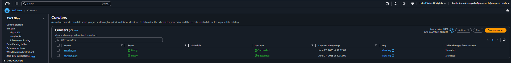

# Desafio

Acesse aqui, os entregaveis do desafio:

[CodeJobCSV](../Desafio/jobs_codes/job_csv.py)

[CodeJobJson](../Desafio/jobs_codes/job_json.py)

[ParquetCSV](../Desafio/output_data/csv_parquet/)

[ParquetJson](../Desafio/output_data/json_parquet/)

## Etapa 1

- Para início do desafio, temos que preparar o ambiente e ceder algumas policies e permissões para o glue, então, vamos pesquisar IAM no Console, escolher as permissões necessárias, e criar a Role que será usada no Desafio

## Etapa 2

- Com a Role criada, podemos ir no Glue, e na Seção de Visual ETL, criar nossos dois Jobs (Csv e Json), nessa parte do do desafio, temos que utilizar ApacheSpark e Glue para criar um código que converta os dados na Camada Raw (que estão em formtato CSV e Json), para a Camada Trusted no formato objetivo (Parquet)

- Job_CSV consiste na criação de dois parâmetros, um Input para buscar o caminho do CSV dentro do Bucket S3 na Camada Raw, e outro Output para criar um caminho para o recém-criado arquivo Parquet dentro do Bucket S3, agora na Camada Trusted

- Após a configuração dos parâmetros, criamos uma função chamada conversor_parquet, que recebe dois parâmetros (o argumento de entrada (input), e o argumento de saída (output)) é criado um DynamicFrame, com uma conexão S3, de formato CSV (formato do arquivo buscado) e com o separar do arquivo ("|")

- Com o DF criado, nós usamos a função write para escrever esse DF dentro do Bucket S3, só que agora especificando o novo formato (Parquet)

Abaixo, veja os detalhes e especificações das configurações do Job

Com isso, podemos avançar para o próximo Job

- Job_Json consiste na criação de 4 parâmetros (três de input, e um de output), nos mesmos moldes do Job anterior, os Inputs são parâmetros que buscam os arquivos Json dentro do Bucket S3 na Camada Raw, o Output é o caminho que todos os arquivos serão colocados no mesmo Bucket S3, agora no formato Parquet, e na nova Camada Trusted

- Assim como o código anterior, temos uma função conversor_parquet que recebe um argumento de entrada, e um argumento de saída, o diferencial é que temos duas novidades em relação ao anterior

- O nosso caminho na Camada Raw possui as datas de ingestão do arquivo, e temos que extrair essas datas do nosos caminho para utilizá-las especificamente aqui no Job dos Jsons, para isso, criamos uma função chamada extrair_data, que vai receber o argumento de entrada, analisar ele valor a valor, e identificar padrões que pedirmos, já que todos os dados estão padronizados em formato de data (2025/01/01), utilizamos a função search, para buscar esse padrão de: 4 números, barra, 2 dígitos,  barra, 2 dígitos

- Após isso, separamos os digitos pela barra, tendo assim 3 conjuntos de dígitos (ano, mes e dia), extraídos do nosso argumento de entrada

- Por fim, chamamos os 3 argumentos de entrada, objetemos as datas dos 3, e usamos no nosso Output para colocar cada arquivo Json (agora convertido em Parquet), na Camada Trusted do mesmo jeito que estavam na Camada Raw

Abaixo, veja os detalhes e especificações das configurações do Job

- Com isso, podemos rodar os dois códigos Job, e após alguns minutos, receber a mensagem de sucesso, e ir no S3 confirmar que de fato, a Camada Trusted foi criada

## Etapa 3

- Para finalizar a construção do nosso ambiente, vamos acessar a seção de Crawlers, e criar dois Crawlers responsáveis por ler os nosso arquivos Parquet

- Com o Crawlers criados, podemos rodar eles para assim, criar as tabelas

- Para confirmar o sucesso do Desafio, ir na seção de Tables, abaixo de Database, confirmar que as DataTables foram criadas, e claro, abrir uma delas no Athena para checar os dados

Com isso, finalizamos o Desafio da Sprint6, criamos um ambiente para nossos dados, utilizamos Glue para convertê-los para Parquet, um formato necessário para a construção dos Crawlers e leitura no Athena, utilizando a linguagem SQL
