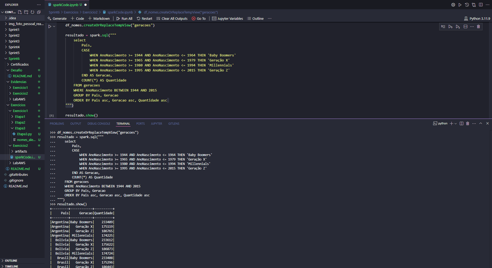
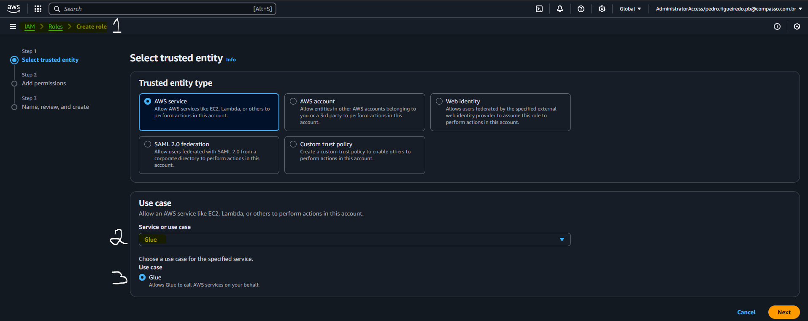

# Resumo

## Fundamental of Analytics on AWS - Part 2

- Curso com duração de 1:30h onde pude obter conhecimentos de análise de dados na AWS, o curso abragiu:

  - Conceitos de Data Lake, Data Warehouses e Arquitetura de Dados na AWS
  - Exemplos de Caso para aprendizagem na criação e uso de ferramentas AWS como Amazon Redshift, Lake Formation, S3, Athena, Glue, dentre outros
  - Casos de uso comum, arquituras de referência e seus pilares e padrões, como o data mesh

## AWS Glue Getting Started

- Curso com duração de 1h onde pube obter conhecimentos sobre a arquitetura Glue, o curso abrangiu:

  - Componentes chave do Glue, como o Glue Studio, Glue Catalog, e DataBrew
  - Exemplos de Caso como ETL e ELT, processamento em lotes
  - Familiarização com ferramentas de catalogação de dados, geração e rodagem de Jobs, Crawlers, Databases, e consulta de dados via Athena

# Exercicios

## Geração e Massa de Dados

### Etapa 1

O entregável da Etapa 1 pode ser encontrado aqui:

[CodigoEtapa1](../Sprint6/Exercicios/Exercicio1/Etapa1/Etapa1.py)

### Etapa 2

O entregável da Etapa 2 pode ser encontrado aqui:

[CodigoEtapa2](../Sprint6/Exercicios/Exercicio1/Etapa2/Etapa2.py)

[TxtEtapa2](../Sprint6/Exercicios/Exercicio1/Etapa2/animais.txt)

### Etapa 3

O entregável da Etapa 3 pode ser encontrado aqui:

[CodigoEtapa3](../Sprint6/Exercicios/Exercicio1/Etapa3/Etapa3.py)

[TxtEtapa3](../Sprint6/Exercicios/Exercicio1/Etapa3/nomes_aleatorios.txt)

## Apache Spark

O entregável do Exercicio pode ser encontrado aqui:

[CodigoEtapa1](../Sprint6/Exercicios/Exercicio2/ex2.py)

[JupiterEtapa1](../Sprint6/Exercicios/Exercicio2/sparkCode%20copy.ipynb)

## Lab AWS Glue

O entregável do Laboratório pode ser encontrado aqui:

[CodeGlue](../Sprint6/Exercicios/LabAWS/labAWS.py)

[CsvNomes](../Sprint6/Exercicios/LabAWS/data/nomes.csv)

# Evidencias

## Geração e Massa de Dados

### Etapa 1

- O objetivo da Etapa 1 é declarar uma lista que contenha 250 números inteiros obtidos de forma aletória, devemos aplicar o método Reversed sobre o conteúdo e imprimir o resultado

- É declarada uma lista de numeros vazia, e usando um laço for, e para gerar até 250 numeros, será gerado um numero aletório de 1 a 1000, e este, será armazenado na lista criada, e por fim, printada na tela

- Após isso, o método Reversed será criado, e a lista reversa será printada na tela, para confirmar que a lista reversa é de fato o inverso da lista original, é passada uma condição if, que compara a lista invertida usando reversed, com uma lista inversa criada a partir da contagem do ultimo número até o primeiro, caso as duas sejam iguais, então é printada uma mensagem confirmando que a função reversed funcionou corretamente

### Etapa 2

- O objetivo da Etapa 2 é declarar uma lista contendo o nome de 20 animais, ordená-los de forma crescente, e iterá-los imprimindo um a um, após isso, armazenar o conteúdo da lista em um arquivo txt externo, um por linha

- É declarada uma lista vazia preenchida por 20 nomes, após isso, usamos a função sort para ordenar de forma crescente, e com um laço for, é iterado sobre os itens um a um uma função print

- Com isso feito, utilizando a biblioteca with open, criamos um arquivo txt, e imprimimos todos os nomes dentro do arquivo, utilizando \n para pular para a linha seguinte, imprimindo assim, um nome por linha

### Etapa 3

- O objetivo da Etapa 3 é utilizar a instalação da biblioteca names para gerar uma lista com 10 milhões de nomes aletórios, sendo 39880 deles únicos (armazenados em outra lista), após gerar as listas, criar um arquivo de texto, com todos os nomes, impressos um por linha

- São declaradas uma lista, uma para nomes aletórios, e outra para nomes únicos, utilizando a random.seed para inicialização da geração dos valores randômicos

- Com a declaração de uma lista auxiliar vazia, para um laço com valor máximo igual ao de nomes únicos, a biblioteca names é chamada, e para cada nome criado, ele é passado dentro da lista, caso ele já exista dentro da lista, é descartado e um novo é gerado, caso contrário, o nome é adicionado na lista

- O mesmo processo se repete para a lista vazia dados, que é preenchida pelo mesma estrutura de laço for, só que agora, são gerados 10 milhões de nomes, e todos são adicionados na lista enquanto não bater o limite estabelecido

## Apache Spark

### Etapa 1

- O objetivo da Etapa 1 é realizar a aplicação dos recursos básicos para manipulação de dataframes através do Apache Spark, utilizaremos o arquivo de nomes aletórios criados anteriormente para tal laboratório

### Etapa 2

- Após isso, usamos o método printSchemat para ver o esquema do nosso dataframe, renomeamos a coluna utilizando withColumnRename, e mostramos as 10 primeiras linhas com a função show()

### Etapa 3, 4, 5

- Após isso iremos adicionar novas colunas no nosso dataframe e para cada coluna iremos criar um array com dados específicos, que utilizando a função rand, iremos escolher uma delas aleatoriamente e atribuir a cada linha da coluna, o mesmo processo vai se repetir nas Etapa 4 e 5

### Etapa 6

- Na Etapa 6 iremos utilizar o método select para selecionar no nosso dataframe as pessoas que nasceram neste século, e armazenar o resultado em um outro dataframe chamado df_select, e mostrar suas 10 primeiras linhas

### Etapa 7

- Na Etapa 7 iremos repetir o processo da Etapa6, só que utilizando SparkSQL, registrando sempre uma tabela temporária para utilizar a linguagem nas consultas de forma apropriada

### Etapa 8, 9

- Na Etapa 8 utilizamos a função filter para filtrar todas as pessoas pertencentes à geração Millenial (nascidos entre 1980 e 1994), após isso, realizamos o mesmo processo com SparkSQL na Etapa9

### Etapa 10

- Na próxima e última Etapa 10, utilizando SparkSQL, contaremos a quantidade de pessoas pertencentes a cada país, e depois as dividiremos nas gerações, tendo assim, a quantidades de pessoas de cada geração, de cada país no dataset

## Lab AWS Glue

### Etapa 1

- O objetivo da Etapa 1 é criar um bucket S3 e armazenar um arquivo CSV chamado nomes, em um caminho pré-determinado, para utilizarmos durante a realização do laboratório

### Etapa 2 

- Iremos criar uma IAM Role com permissões policies específicas para realização Lab, primeiro, pesquisar IAM no Console

- Clicar em Create Role

- Escolher as permissões necessárias para realização do laboratório e criar a Role

### Etapa 3 

- Com a Role criada, pesquisar por AWS Glue no console

- Em Setup Roles, selecionar a Role criada anteriormente

- Dar permissões de leitura e escrita 

- Criar um perfil Standard 

- Confirmas as opções selecionadas e criar 

### Etapa 4

- Pesquisar por Lake Formation no Console

- Por ser primeira interação, clicar em Add Myself

- Criar um Database chamado glue-lab

### Etapa 5

- Criar Job no Glue

- Ir em Job Details, inserir o nome job_aws_glue_lab4 e todos as configurações necessárias

- Ir em Advanced Details e inserir os parâmetros necessários 

- Criar um código utilizando funções Glue nos moldes dos exemplos mostrados

- Rodar o Código e esperar a confirmação de sucesso

### Etapa 6

- Criar Crawler que aponta para o JobCriado a partir dos dados do S3

- Com o Crawler criado, temos que executar ele para então uma tabela ser criada

- Ir em Tables na Seção Databases, e na tabela criada, clicar em View Data Tables

- E após executar uma simples consulta SQL, é possível confirmar que o Athena funciona o laboratório foi executado com sucesso

# Certificados

