# Desafio Sprint7

---

## Modelagem

O desafio se inicia com a realização da modelagem dimensional do nosso Desafio, a priori, temos 4 tabelas para estudar:

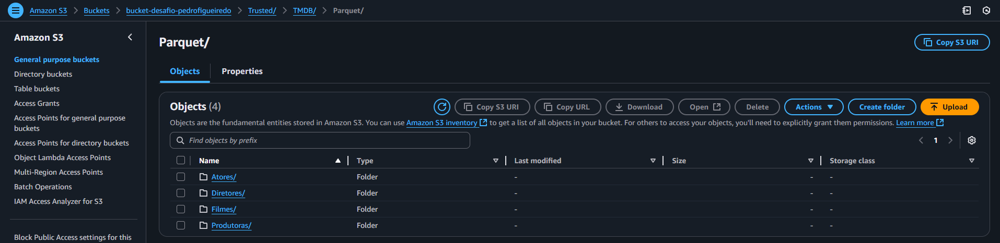

- Tabela Atores: com informações sobre os 5 primeiros atores de cada filme pesquisado
- Tabela Diretores: com informações sobre os diretores de cada filme pesquisado
- Tabela Filmes: com informações e métricas sobre cada filme pesquisado
- Tabela Produtoras: com informações sobre as produtoras de cada filme pesquisado

A modelagem dimensional se inicia com a criação de um fato central, no caso do nosso estudo sobre os filmes da carreira da diretora Greta Gerwig, será um fato_filme, e por via de regra da modelagem dimensional, dimensões devem possuir apenas informações de contexto, enquanto tabelas fato devem possuir apenas métricas que serão usadas para análise, então o nosso fato_filme irá ter as métricas da tabela filme, enquanto a dimensão_filme (dim_filme), terá as informações de contexto, e os dois possuirão um relacionamento entre si

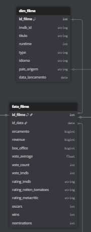

As outras tabelas (Atores, Diretores, e Produtoras) serão dimensões próprias, possuindo suas informações pra si, e terão um relacionamento com a fato_filme, porém, isso acarretaria em um relacionamento N pra N, já que um filme pode ter vários atores, diretores e produtoras, e estes, podem estar presentes em vários filmes, logo, por exigência do modelo dimensional e para a realização do exercício, se faz necessária a criação de uma tabela intermediária, também chamada de tabela de junção, ou tabela ponte, esta possuirá consigo as chaves primárias da dimensão e fato envolvidos, designados como chave estrangeira

Além dessas três, outra tabela será criada via Glue, esta possuirá os IDs dos gêneros dos filmes, e já que um filme pode ter vários gêneros, e um mesmo gênero pode estar presente em vários filmes, também será realizado o mesmo processo citado no parágrafo anterior, abaixo, uma imagem do resultado dessa modelagem

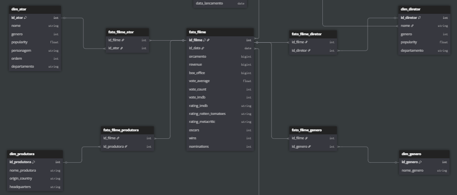

Por fim, toda modelagem deve ter uma dimensão que abrange o tempo, esta terá informações do dia, mês, ano, trimestre, semestre, dia_semana, e outras métricas temporais, para realizar uma análise rica, os IDs, claro, serão referentes às datas de lançamento dos filmes, então o relacionamento desta dimensão tempo (dim_tempo), assim como a dim_filme, será direto com a fato_filme, sem intermédio de outros

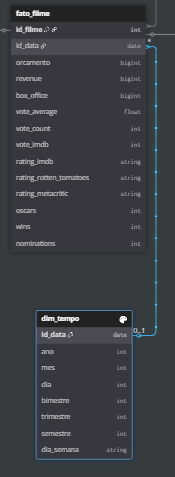

O resultado final da nossa modelagem é o que se pode ser visto abaixo, uma modelagem em estrela e desnormalizada, como exige a modelagem dimensional para BI

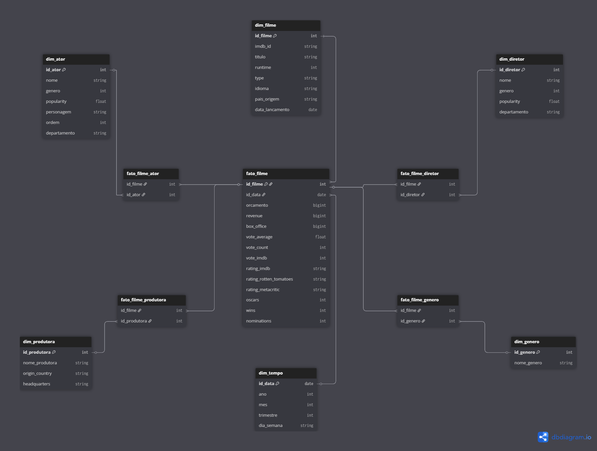

O diagrama do modelo dimensional foi realizado via ferramenta DbDiagram.Io, caso seja de interesse replicar a modelagem localmente, o código para criação da modelagem pode ser encontrado abaixo, caso não, o link para acessar este diagrama diretamente na plataforma estará abaixo:

[CodigoDbDiagram](./Codigos/Modelagem/dbdiagram.sql)

[LinkDbDiagram](https://dbdiagram.io/d/dbdiagram-desafio-6866b75ef413ba35082caaca)

## Código

O código se inicia com a importação das bibliotecas normais do JOB no GLUE, e com a definição dos argumentos que serão utilizado, argumentos INPUT, que localizam as pastas com os arquivos Parquet na camada Trusted, e o argumento OUTPUT, que cria a camada Refined e insere os arquivos Parquet resultantes organizados

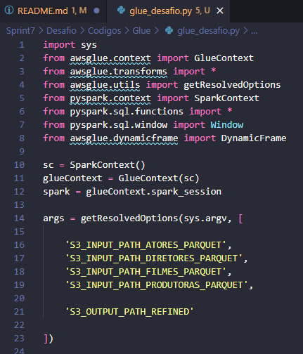

Criamos uma função chamada save_df, que recebe como parâmetros, o Dataframe que será convertido para Parquet, o nome que o arquivo terá dentro do S3, e o tipo de Dataframe (se é Fato, Ponte ou Dimensão), ela utiliza a função nativa do próprio Glue que é criada quando se inicia o Job, apenas encaixamos ela dentro de uma função para ser responsivo

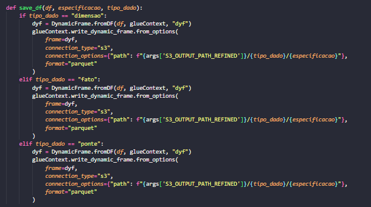

Com isso, podemos avançar e iniciar a leitura dos dados em Parquet da camada Trusted, usando os argumentos para localizar os arquivos em suas pastas, e o resultado nós transformamos em um dataframe possível de ser manipulado pelo Spark, usando a função toDF(), e armazenados esse Dataframe em uma variável de mesmo nome

Realizamos algumas limpezas e ajustes nos dados para facilitar a leitura e comparação, a primeira delas é ir na coluna "vote_imdb" que possui dados no formato "10,000" e para usarmos em comparações temos que retirar a virgula, usando a função replace, e depois convertemos para inteiro, usando a função Cast ("int")

A segunda limpeza é converter a data de lançamento que está no formato brasileiro dia/mes/ano, e converter ela para o formato date comum, que pode ser reconhecido pelo Spark, no caso, ano/mes/dia

A terceira ação é usar o explode para separarmos os diferentes gêneros dentro de um mesmo registro na coluna genres, transformando o array em registros com gêneros únicos, usando a vírgula como separador na leitura

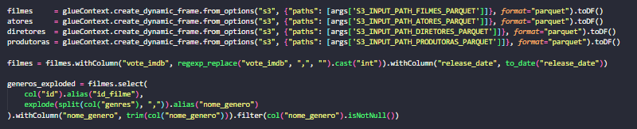

Com a limpeza feita, é hora de criar as nossas tabelas que referenciam a modelagem montada, usando selectExpr, selecionamos as colunas específicas, e armazenamos elas na variável a qual ela pertence

Para a dimensão gênero, usamos dense_rank para realizar a leitura dos gêneros e armazenar eles em IDs que serão criados dentro da tabela, ordenada de forma crescente, e claro, sem duplicatas

Na dimensão tempo, criamos colunas ordenadas pelo ID_Data que referencia as datas de lançamento do filme, e com funções year/month/dayofmonth/quarter criamos colunas com o dia, mes, ano, semestre, trimestre e dia da semana (string), e assim conseguimos realizar análises temporais mais ricas caso necessário

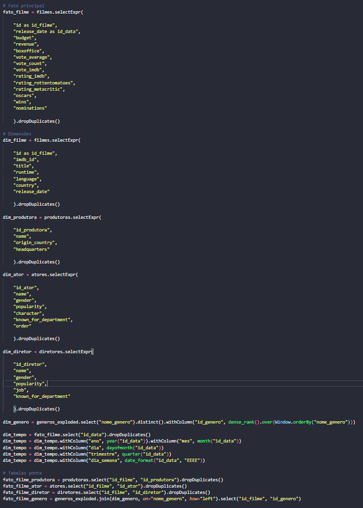

Por fim, com os dataframes criados e as colunas direcionadas de forma correta, chamamos a função save_df criada no início, fornecendo o Dataframe, o nome que ele terá no S3 e o tipo dele dentro da modelagem, para cada dataframe do modelo

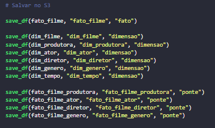

## Execucao

Para executar o código Glue criado, temos que criar um job dentro da ferramenta AWS Glue, no nosso caso, job_parquet

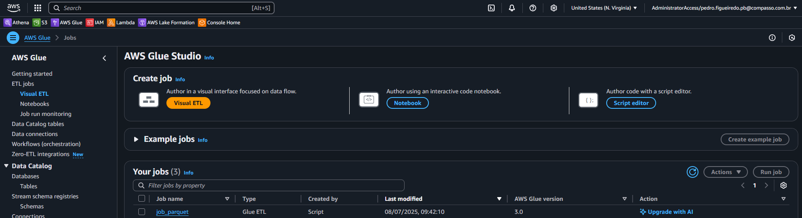

Com o Job, parâmetros estabelecidos, podemos rodar o Job Parquet e com a mensagem de sucesso, prosseguir na execução

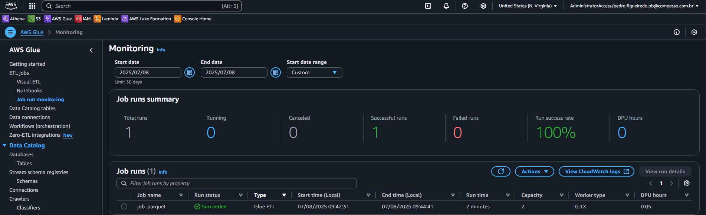

Para checar o sucesso do JOB, iremos no nosso bucket S3, checar se a camada Refined foi criada, juntamente com as subpastas, os dataframes e os arquivos Parquet que leremos em breve no Data Catalog

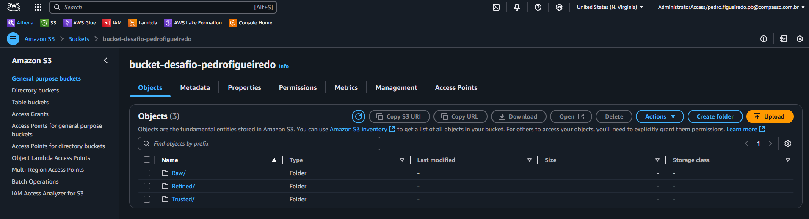

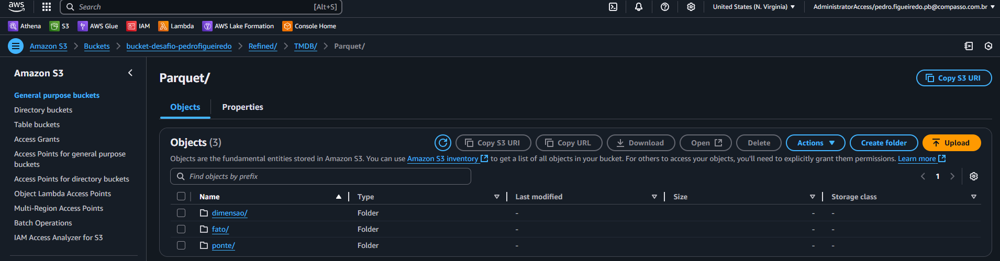

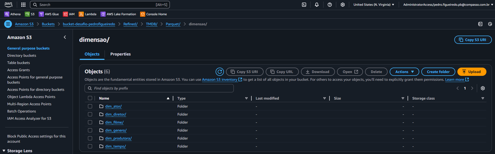

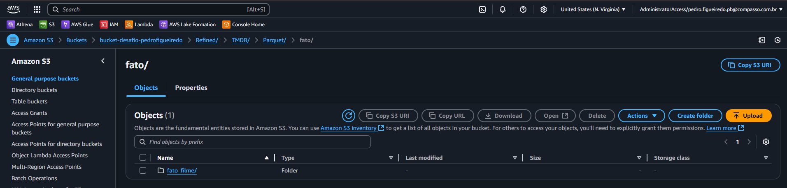

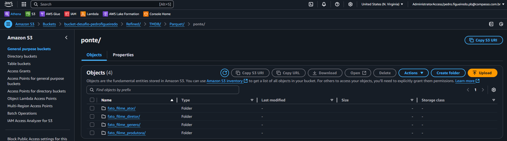

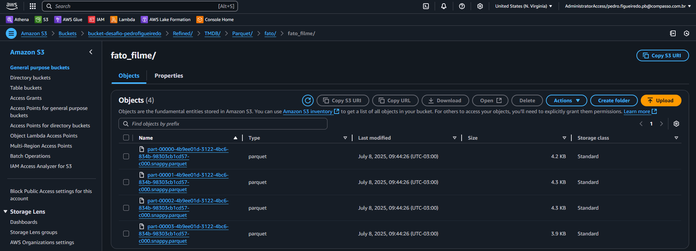

Agora, podemos criar um Crawler para criar as tabelas dentro do AWS Catalog, no nosso caso, ele se chamará crawler_parquet

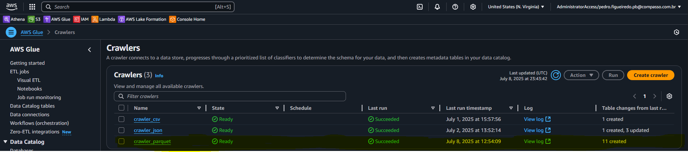

Com o Crawler bem sucedido, vamos na seção Tables, abaixo de Database e conferimos se as tabelas foram criadas corretamente

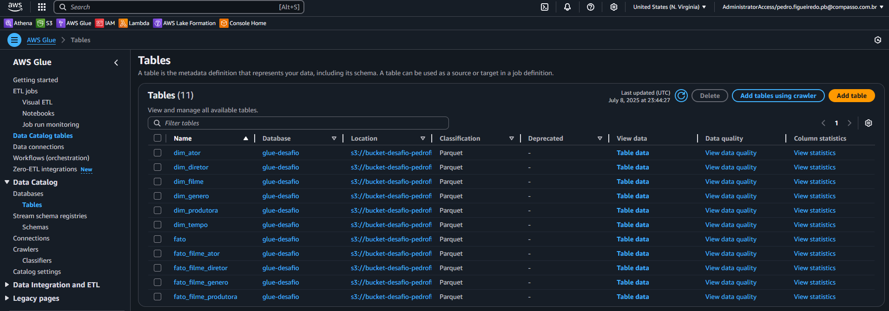

Agora com as tabelas criadas, vamos checar a consistência dos dados fazendo uma simples consulta SQL

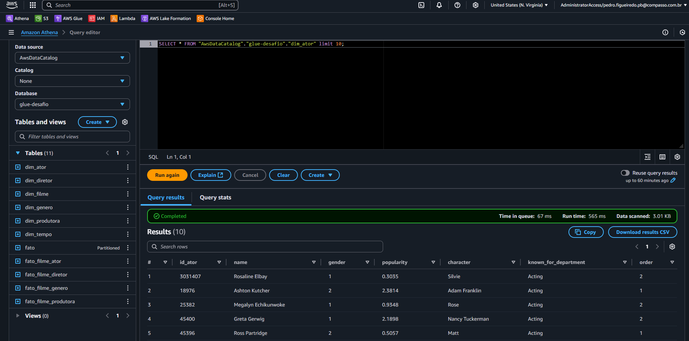