# Desafio

O desafio da Sprint8, consistem em consumir os dados de nossas tabelas criadas no Athena, alimentadas pelos arquivos Parquet dentro da camada Refined em nosso S3, e visualizarmos esses dados dentro do AWS QuickSight através de Visuais, que terão o objetivo de criar Insights que respondem as perguntas criadas na Sprint5, por fim, os Visuais serão organizados juntos em um Dashboards ainda na mesma ferramenta, convertidos em PDF e disponibilizados para consulta no Github, caso seja de seu interesse, o Dashboard (em tom Claro e Escuro, para escolha do leitor) pode ser encontrado aqui:

[DashPreto](./DashBoards/DashPreto.pdf)

[DashBranco](./DashBoards/DashBranco.pdf)

Dividiremos nosso Desafio em três estágios, o primeiro será a criação das Views dentro do Athena, e as perguntas as quais eles pretendem responder; o segundo será a criação dos Datasets dentro do AWS QuickSight, apontando para nossas Views criadas e a criação dos Visuais em nosso Analysis principal; o terceiro será a organização do Dashboard, pensando em conceitos de UI e UX

## Parte 1 - Criação das Views

O nosso DashBoard pretende ser dividido em 4 núcleos diferentes, com perguntas-base, e que dentro deles, terão visuais respondendo questionamentos mais incisivos, os núcleos são:

- Núcleo Filmes: O princial do Dashboard, usando a dimensão filme/gênero/tempo e a fato iremos responder a pergunta-base "Qual o perfil e características dos filmes envolvendo Greta Gerwig?"

- Núcleo Atores: Núcleo do Dashboard que usará a dimensão atores para responder a pergunta-base "Qual o perfil dos atores que trabalharam em filmes envolvendo Greta Gerwig?"

- Núcleo Diretores: Núcleo do Dashboard que usará a dimensão diretores para responder a pergunta-base "Qual o perfil dos diretores que trabalharam em filmes envolvendo Greta Gerwig?"

- Núcleo Produtoras: Núcleo do Dashboard que usará a dimensão produtoras para responder a pergunta-base "Qual o perfil das produtoras que bancaram filmes envolvendo Greta Gerwig?"

Em cada núcleo, terão questionamentos específicos (criados na Sprint5), que serão respondidos por visuais alimentados pelas views criadas via Athena, vamos passar por cada um deles

### Núcleo Filmes

#### Questionamento 1

Pergunta: "Qual são os gêneros predominantes da carreira de Greta Gerwig?"

Objetivo: Identificar possível foco artístico e tipos de histórias que Greta costuma escolher para criar

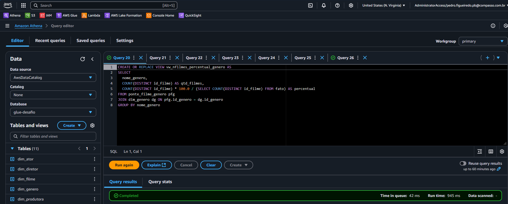

- O código SQL consiste na seleção dos campos "nome_genero" da dimensão genero e "id_filme" pela ponte entre as duas dimensões, usa-se distinct para pegar a quantidade de filmes únicos e o percentual deles dividindo a quantidade por 100

#### Questionamento 2

Pergunta: “Como evoluíram orçamento, receita e lucro dos filmes ao longo dos anos?”

Objetivo: Analisar crescimento de investimento e retorno financeiro ao longo da carreira.

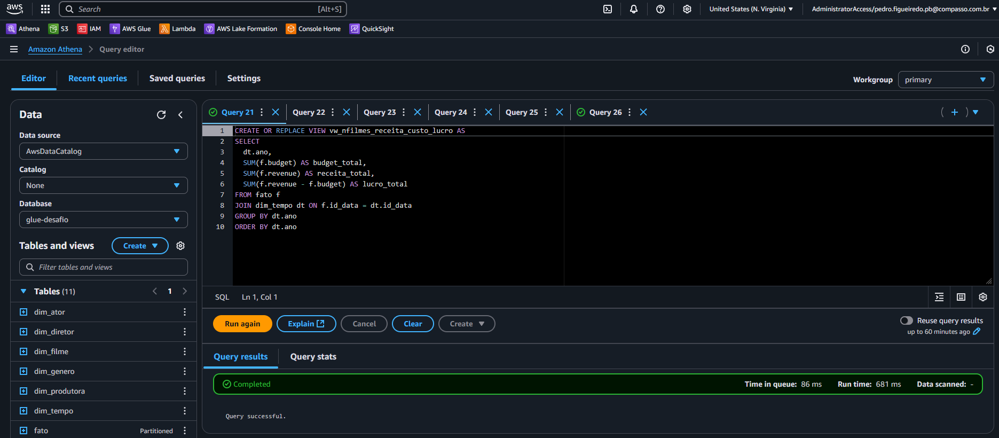

- O código SQL consiste na seleção dos campos "ano" da dimensão tempo, e a soma dos campos "budget" e "revenue" da dimensão fato, e a criação de uma coluna denominada "lucro", que é o resultado da subtração entre "revenue" e "budget"

#### Questionamento 3

Pergunta: “Quais filmes são mais bem avaliados pela crítica?”

Objetivo: Apontar principais obras segundo público (IMDb) e crítica (Rotten Tomatoes)

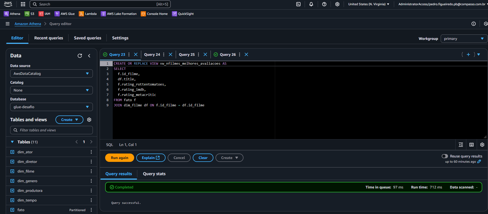

- O código SQL consiste na seleção dos campos "title" da dimensão filme, e dos campos "id_filme", "rating_rottentomates", "rating_imdb" e "rating_metacritic" da fato

#### Questionamento 4

Pergunta: “Qual a participação de Greta como atriz, diretora ou outros?”

Objetivo: Entender distribuição de papéis na carreira

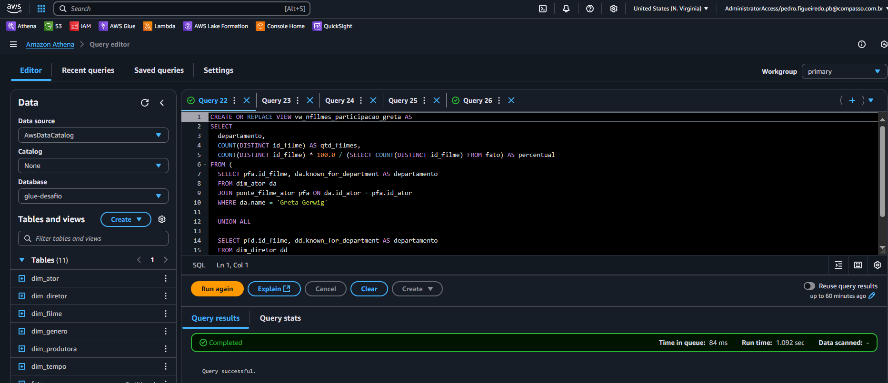

- O código SQL consiste na seleção dos campos departamento presente nas dimensões ator, e na dimensão diretor, além disso a quantidade de filmes unicos com a função count e distinct pra não ter IDs duplicados, uma subquerie coleta a quantidade de filmes da Greta nas função através de filtro de nome

### Núcleo Atores

#### Questionamento 5

Pergunta: “Quais atores mais trabalharam com Greta Gerwig?”

Objetivo: Identificar relações de parceria e atores mais recorrentes

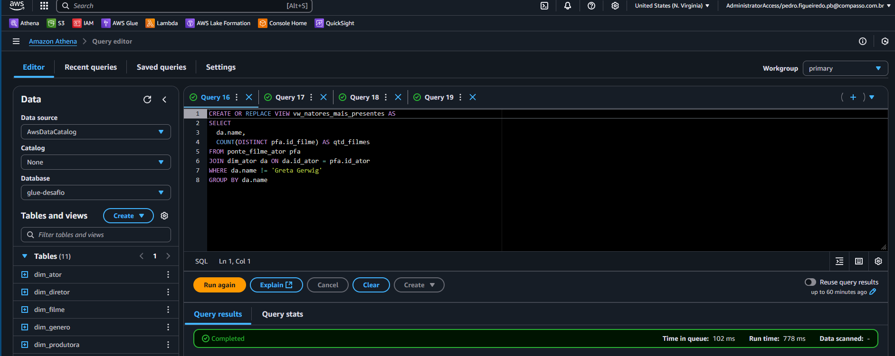

- O código SQL consiste na seleção dos campos "nome" presente na dimensão ator, e da contagem de filmes únicos em que cada um participou usando count e distinct via "id_filme" da ponte que conecta as tabelas, um filtro "diferente de:" (!=) é usado para não pegar a participação da própria Greta em filmes que tenha atuado

#### Questionamento 6

Pergunta: “Quem são os atores mais populares?”

Objetivo: Avaliar se Greta trabalhou com nomes de peso durante a carreira

- O código SQL consiste na seleção dos campos "nome" e "popularidade" da dimensão ator, via ponte que conecta as duas tabelas, usando o mesmo filtro anteriormente para não coletar valores da prórpia Greta

#### Questionamento 7

Pergunta: “Qual a diversidade de gênero entre os atores?”

Objetivo: Analisar representatividade de gênero no elenco durante sua carreira, diversidade

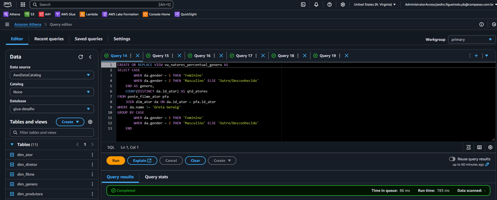

- O código SQL consiste na seleção dos campos "genero" da dimensão atores e a quantidade de atores unicos para evitar nomes duplicados, um condição é passada para garantir que os generos coletados sejam "Masculino", "Feminino", ou "Outros/Desconhecido", com filtro para não coletar a própria Greta no loop

### Núcleo Diretores

#### Questionamento 8

Pergunta: “Quais diretores mais trabalharam com Greta Gerwig?”

Objetivo: Identificar parcerias criativas frequentes e inspirações

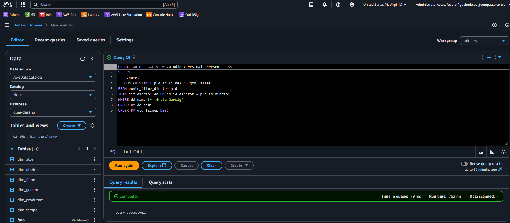

- O código SQL consiste na seleção dos campos "nome" da dimensão diretores e a quantidade de filmes unicos para evitar duplicatas, usando filtro para não pegar os filmes dirigido pela Greta

#### Questionamento 9

Pergunta: “Quem são os diretores mais populares?”

Objetivo: Avaliar se há colaborações com nomes de destaque durante a carreira

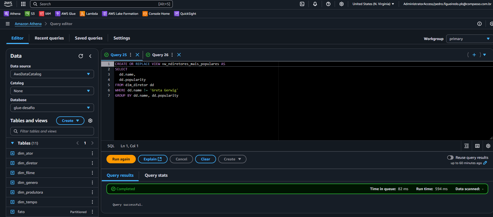

- O código SQL consiste na seleção dos campos "nome" e "popularidade" da dimensão diretores, com filtro para não coletar as informações da própria Greta

#### Questionamento 10

Pergunta: “Qual a diversidade de gênero entre os diretores?”

Objetivo: Checar representatividade de gênero na direção durante sua carreira

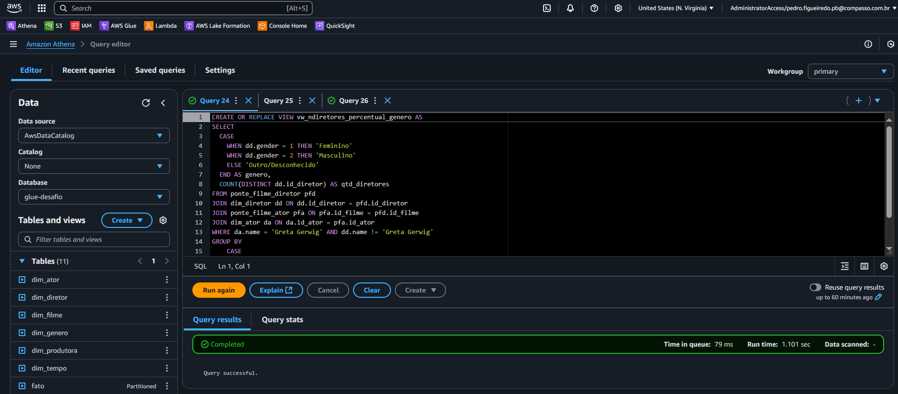

- O código SQL consiste na seleção dos campos "genero" através de condição When nos mesmos moldes do Núcleo Atores e quantidade de diretores únicos para evitar nome duplicados

### Núcleo Produtoras

#### Questionamento 11

Pergunta: “Quais produtoras mais aparecem em filmes com Greta Gerwig?”

Objetivo: Verificar parcerias estratégicas ao longo da carreira, relações de confiança, e modelo de trabalho

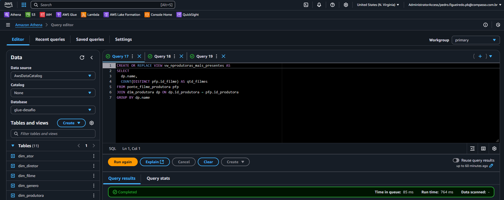

- O código SQL consiste na seleção dos campos "nome" da dimensão produtora e da quantidade de filmes unicos que cada produtora bancou, usando distinct e count para evitar duplicatas

#### Questionamento 12

Pergunta: “Quais produtoras mais lucraram com filmes da Greta?”

Objetivo: Avaliar retorno financeiro para parceiros, complementa a recorrência

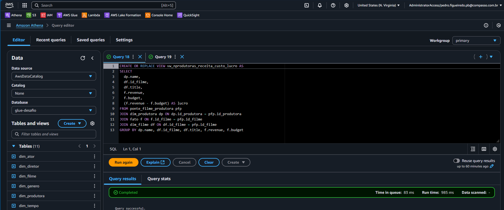

- O código SQL consiste na seleção dos campos "nome" da dimensão produtora, "title" e "id_filme" da dimensão filme, "revenue", "budget" e "lucro" da fato

#### Questionamento 13

Pergunta: “De quais países são as produtoras?”

Objetivo: Analisar foco geográfico — local ou internacional, alcance da marca Greta Gerwig no mercado do cinema

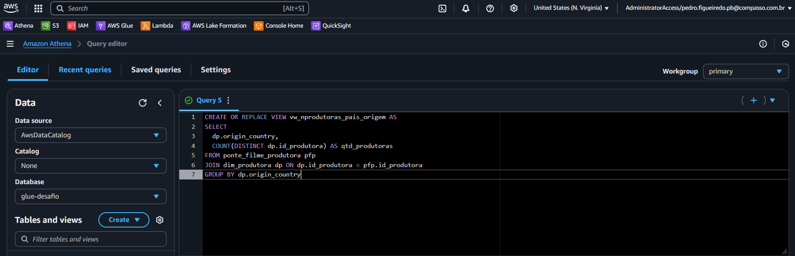

- O código SQL consiste na seleção dos campos "origin_country" da dimensão produtora e da quantidade de produtoras únicas usando distinct para evitar duplicadas

---

Para ver os códigos SQL usados em cada questionamentos, de cada núcleo, acesse por aqui:

[NucleoFilmes](./ArquivosSQL/NucleoFilmes/)

[NucleoAtor](./ArquivosSQL/NucleoAtor/)

[NucleoDiretor](./ArquivosSQL/NucleoDiretor/)

[NucleoProdutora](./ArquivosSQL/NucleoProdutora/)

No Athena, o resultado da criação das views, ficou assim:

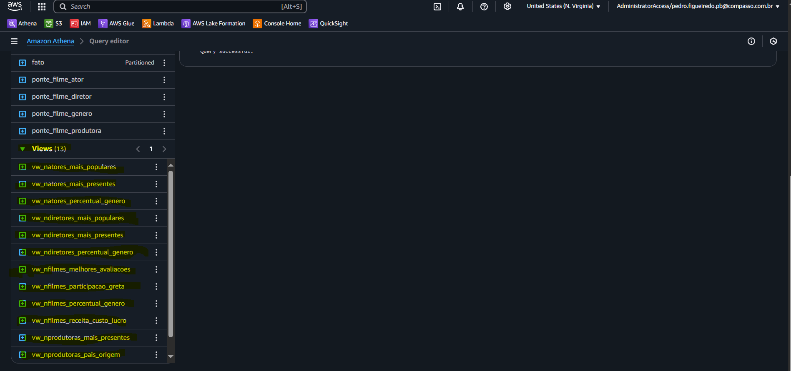

## Parte 2 - Montagem dos Visuais

- Dentro da ferramenta AWS QuickSight, iremos em Datasets, "New Dataset" e adicionar todas as nossas views criadas o resultado final será esse:

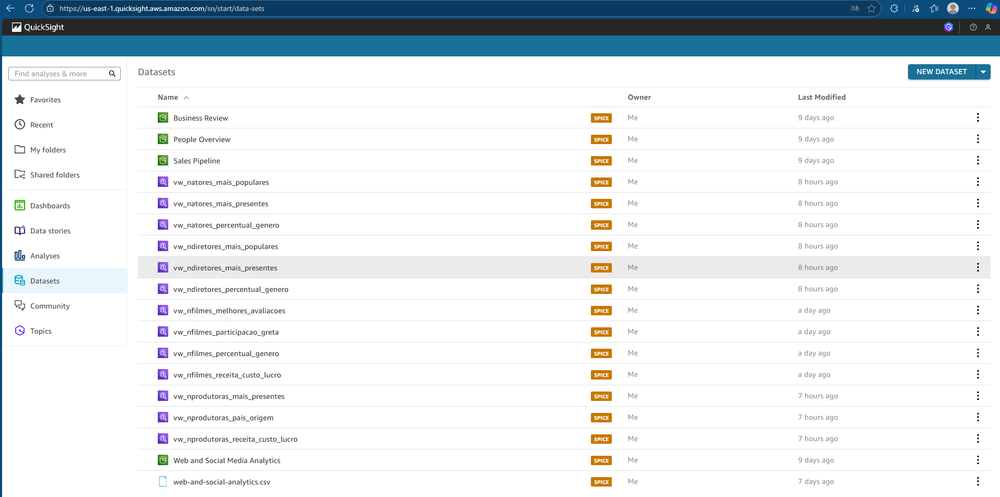

- Por obrigação, para cada dataset, será criado um Analysis dentro do QuickSight, porém iremos criar um outro Analysis próprio para o Desafio, e iremos adicionar todos os Datasets criados dentro dele usando o SPICE para otimizar o processo:

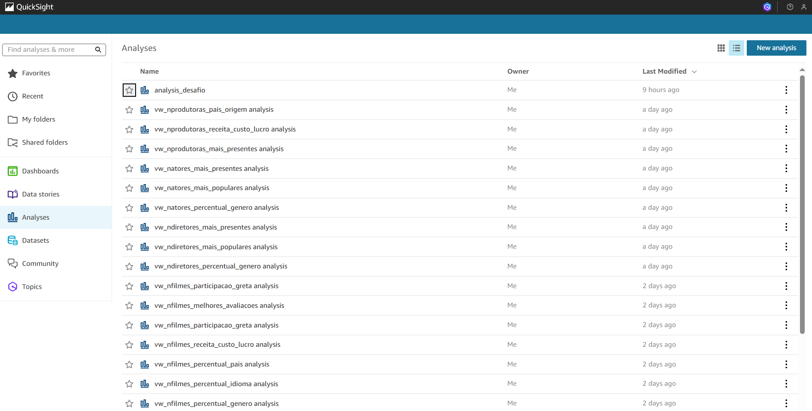

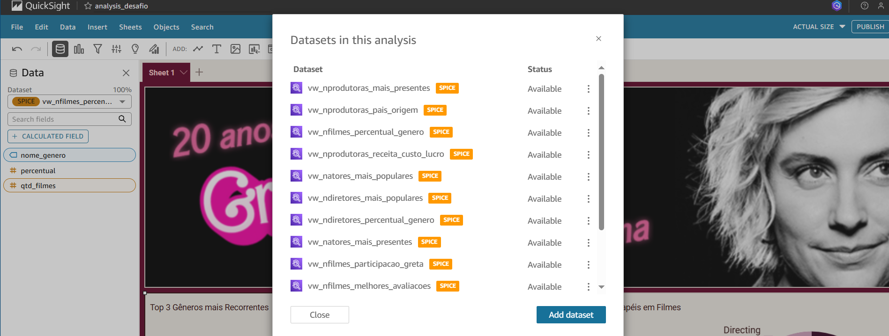

### NucleoFilmes

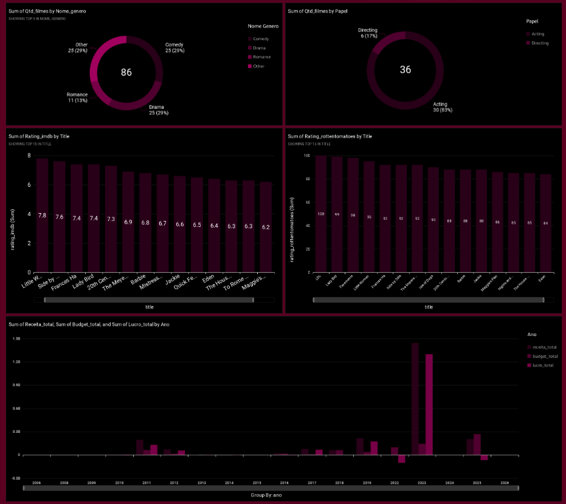

#### Questionamento 1

Pergunta: "Qual são os gêneros predominantes da carreira de Greta Gerwig?"

Objetivo: Identificar possível foco artístico e tipos de histórias que Greta costuma escolher para criar

Resultado: 71% dos Gêneros de toda a carreira da Greta são focados em apenas 3 três gêneros (Romance, Drama e Comédia)

#### Questionamento 2

Pergunta: “Como evoluíram orçamento, receita e lucro dos filmes ao longo dos anos?”

Objetivo: Analisar crescimento de investimento e retorno financeiro ao longo da carreira.

Resultado: Filmes lucrativos mas em baixa proporção até seu grande sucesso em 2023 "Barbie" que lhe rendeu seu primeiro Oscar da carreira como diretora de cinema

#### Questionamento 3

Pergunta: “Quais filmes são mais bem avaliados pela crítica?”

Objetivo: Apontar principais obras segundo público (IMDb) e crítica (Rotten Tomatoes)

Resultado: Coerencia entre Crítica e Publico, exceto em filmes como "LOL", "Parameters" e "Isle Of Dogs", vistos como polarizores

#### Questionamento 4

Pergunta: “Qual a participação de Greta como atriz, diretora ou outros?”

Objetivo: Entender distribuição de papéis na carreira

Resultado: 83% da carreira voltada à atuação, poucas obras atuando como Diretora

### NucleoAtores

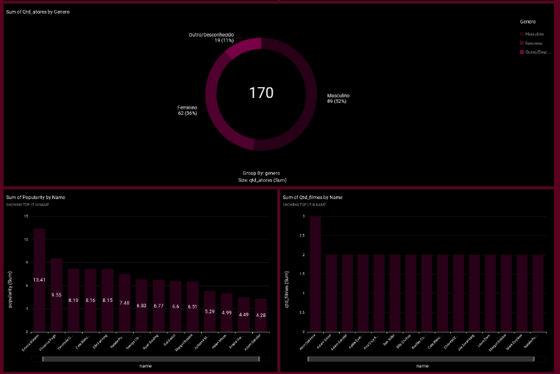

#### Questionamento 5

Pergunta: “Quais atores mais trabalharam com Greta Gerwig?”

Objetivo: Identificar relações de parceria e atores mais recorrentes

Resultado: Destaque para Kent Osbourne, ator que mais participou de obras com a Greta com 3 participações

#### Questionamento 6

Pergunta: “Quem são os atores mais populares?”

Objetivo: Avaliar se Greta trabalhou com nomes de peso durante a carreira

Resultado: Destaque para Emma Watson como atriz mais renomada, com clara diferença para outros do top15 como Florence Pugh, Timothee Chamalet, Cate Blanch e Elle Fenning

#### Questionamento 7

Pergunta: “Qual a diversidade de gênero entre os atores?”

Objetivo: Analisar representatividade de gênero no elenco durante sua carreira, diversidade

Resultado: 52% Masculina, apesar de ser a maioria, o público feminino durante sua carreira tem grande participação com 36% o que reforça uma diversidade de gênero na indústria

### Nucleo Diretores

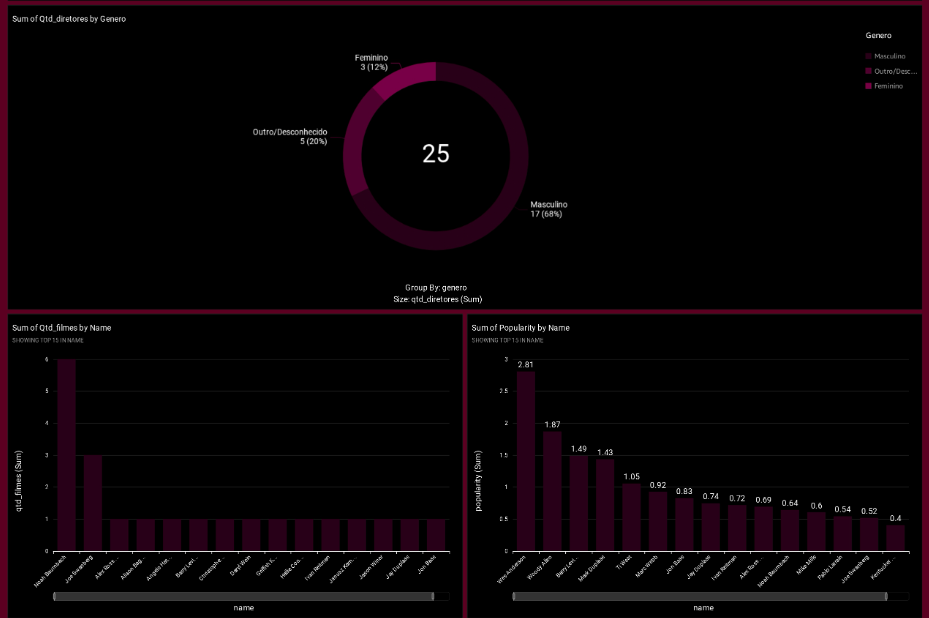

#### Questionamento 8

Pergunta: “Quais diretores mais trabalharam com Greta Gerwig?”

Objetivo: Identificar parcerias criativas frequentes e inspirações

Resultado: Destaque para Noah Dashback e Joe Hashbeg com respectivas seis e 3 participações como Diretores de filmes enquanto a Greta atuava como Atriz

#### Questionamento 9

Pergunta: “Quem são os diretores mais populares?”

Objetivo: Avaliar se há colaborações com nomes de destaque durante a carreira

Resultado: Destaque para Wes Anderson sendo o Diretor mais popular da carreira de Greta como Atriz

#### Questionamento 10

Pergunta: “Qual a diversidade de gênero entre os diretores?”

Objetivo: Checar representatividade de gênero na direção durante sua carreira

Resultado: 68% Masculino, uma clara diferença para o Feminino (12%), mostrando uma falta de diversidade e de diretoras femininas no cinema

### Nucleo Produtoras

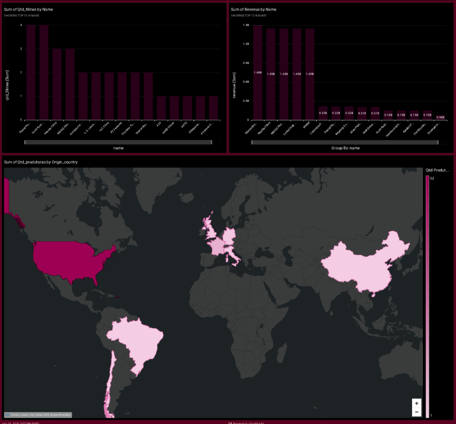

#### Questionamento 11

Pergunta: “Quais produtoras mais aparecem em filmes com Greta Gerwig?”

Objetivo: Verificar parcerias estratégicas ao longo da carreira, relações de confiança, e modelo de trabalho

Resultado: Destaque para Pascal Productions e Scothish Films como Produtoras mais recorrentes da carreira de Greta Gerwig com 4 participações cada

#### Questionamento 12

Pergunta: “Quais produtoras mais lucraram com filmes da Greta?”

Objetivo: Avaliar retorno financeiro para parceiros, complementa a recorrência

Resultado: Destaque para 5 editoras, todas elas com 1.45bi de receita, indicando produtoras que bancaram um mesmo filme e obtiveram seus lucros, muito movido pelo filme Barbie (2023), o grande sucesso da carreira de Greta Gerwig

#### Questionamento 13

Pergunta: “De quais países são as produtoras?”

Objetivo: Analisar foco geográfico — local ou internacional, alcance da marca Greta Gerwig no mercado do cinema

Resultado: Produtoras interessadas são majoritariamente dos Estados Unidos ou Reino Unido, mostrando que a marca Greta Gerwig ainda está pouco visada por produtoras internacionais

---

O resultado final do Dash após a montagem é o seguinte:

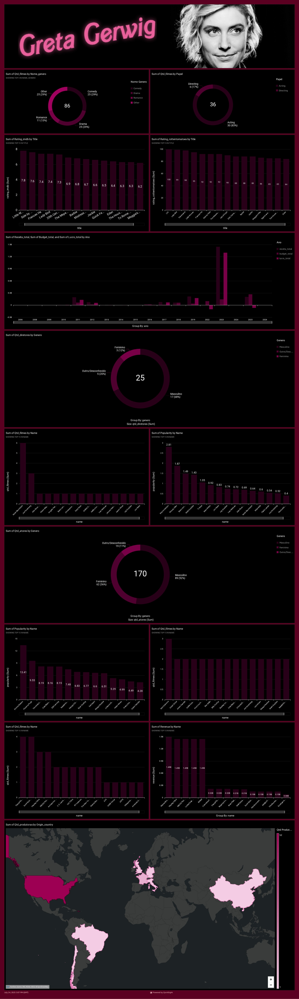

## Parte 3 - UI-UX no Dashboard

Agora, chegamos na parte de UI-UX, começar a analisar o dash, e definir detalhes estratégicos com relação ao desigh, temos que pensar que o leitor tem que perceber, entender e navegar no dashboard sem aumentar a carga cognitiva, fazer ele entender rápido, e sem esforço extra

O dashboard se encontra muito monocromático, com colunas e cores que se escondem no fundo preto, atrapalham a interpretação, o leitor não consegue identificar os núcleos, nem a hierarquia de granularidade dos gráficos, além disso, o banner escrito "Greta Gerwig" não explica de forma clara para o leitor qual o objetivo do dash, gera mais dúvidas do que respostas

Portanto, alterar o banner, e agrupar as informações de seus núcleos é o objetivo, e para isso, usaremos paletas de cores diferentes, que combinem umas com as outras, com o gênero estudado (Romance e Drama), com o banner e com o background do dashboard

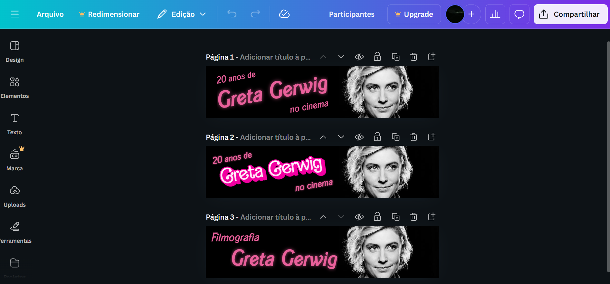

Foi-se criado várias opções de banners, experimentando diferentes tons, tamanhos, frases e enquadramentos, o escolhido foi a Página 2, que deixa claro o objetivo do dash e com a fonte referenciando a logo do grande sucesso da carreira da Greta Gerwig, o filme Barbie (2023)

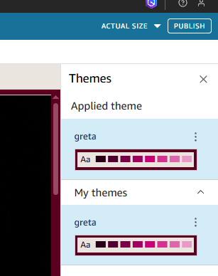

Foi-se criado um thema com a paleta rosa-choque, que combina com o banner e com a imagem em preto e branco

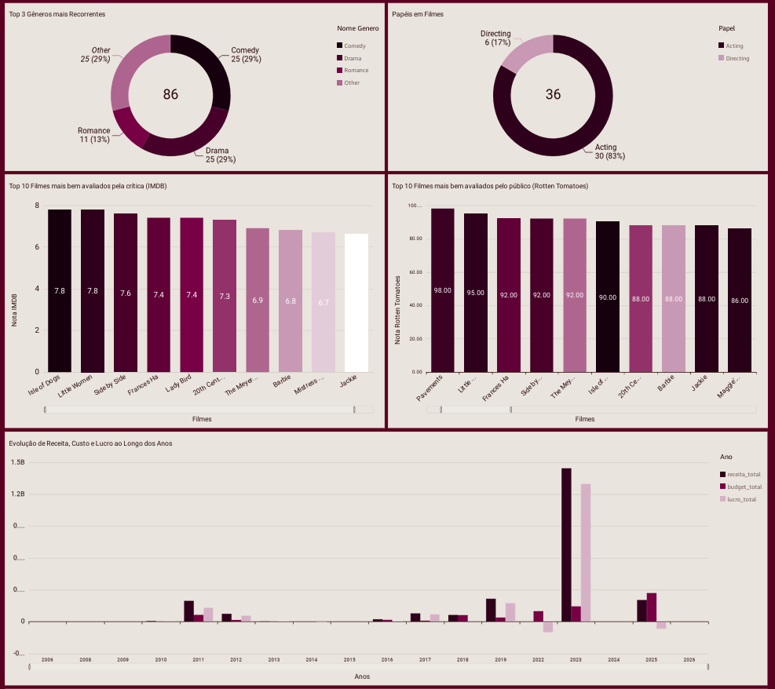

A paleta utilizado no Nucleo Filmes é a mesma do Thema principal, pois este é o núcleo principal do dahsboard e a paleta gera esse agrupamento entre banner e NucleoFilmes

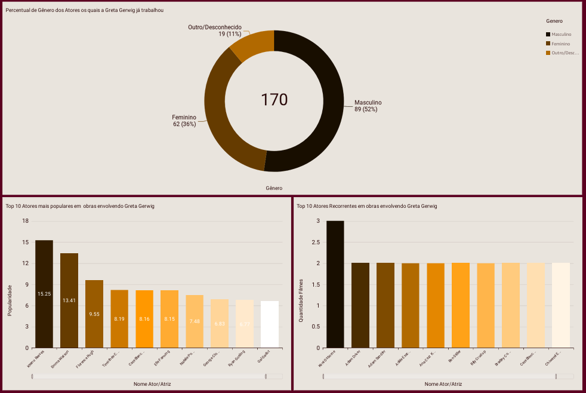

A paleta utilizada foi a paleta da cor laranja, com diferentes contrastes e gradientes

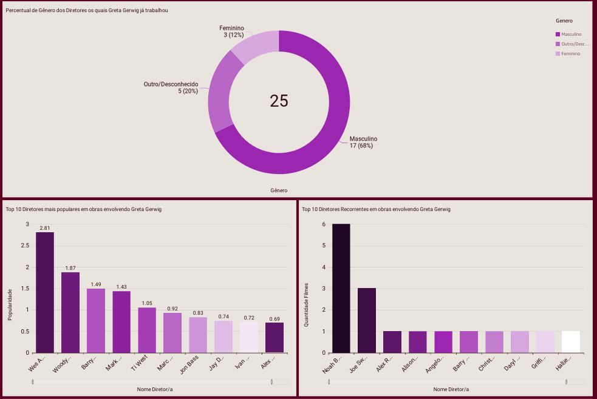

A paleta utilizada foi a paleta da cor roxa, com diferentes contrastes e gradientes

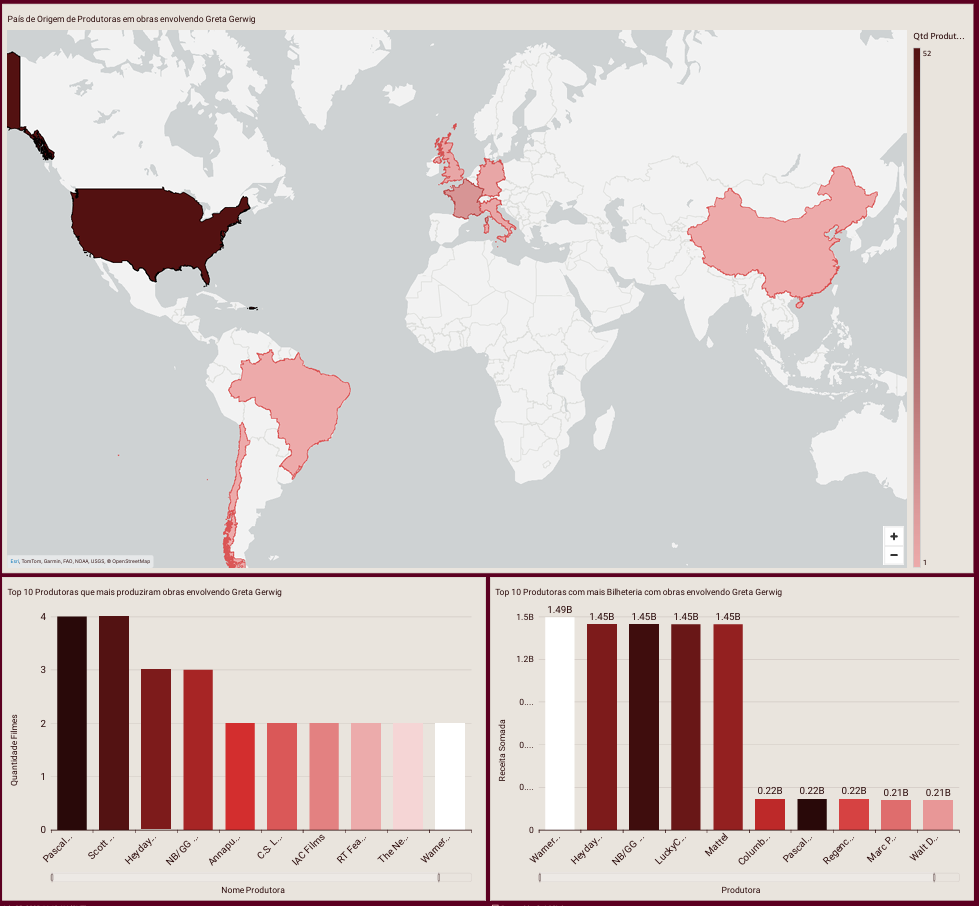

A paleta utilizada foi a paleta da cor vermelha, com diferentes constrates e gradientes

---

Selecionar o tom certo, o contraste, o gradiente, garantir que funcionem bem com o fundo preto/branco, textos, sem poluir, e usando os componentes visuais disponíveis de forma coerente é o objetivo da UI, que é o "como" visualmente você aplica a ideia de UX, após as mudanças o leitor percebe o objetivo do dash pelo banner claro, entende os agrupamentos de gráficos por paletas e navega no dashboard com menos carga cognitiva, entende de forma rápida e sem esforço extra

O dashboard final (em jpg e pdf) é o seguinte:

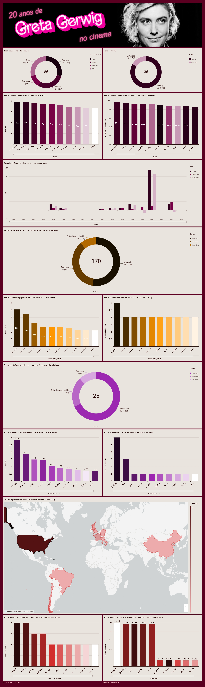

[dashbranco](./DashBoards/DashBranco.pdf)

---

Caso seja de interesse do leitor um dashboard com fundo escuro (que é mais agradável aos olhos para leitura em ambientes mais escuros) pode-se achar aqui:

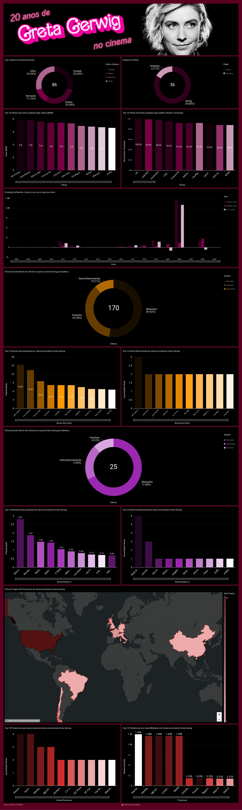

[dashpreto](./DashBoards/DashPreto.pdf)
