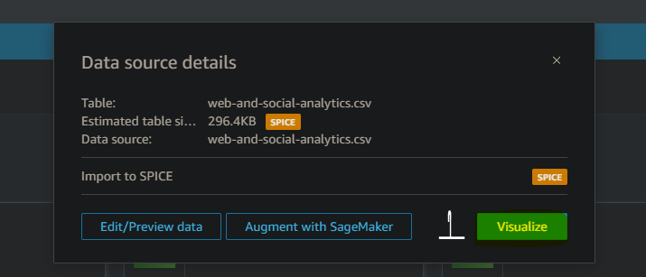
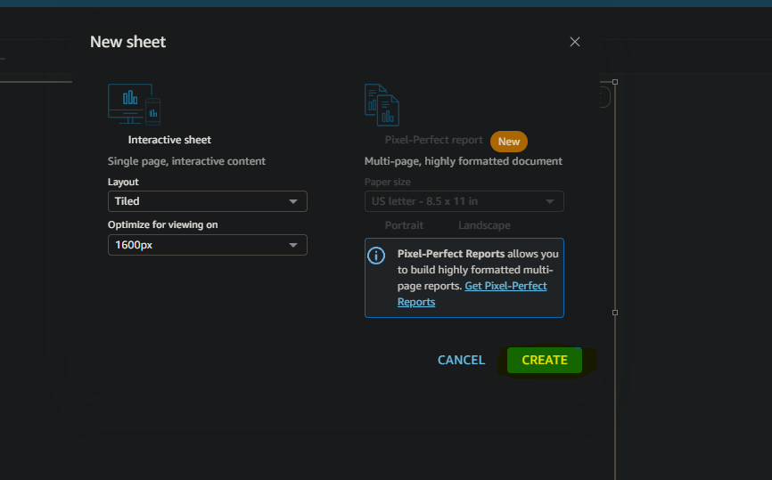
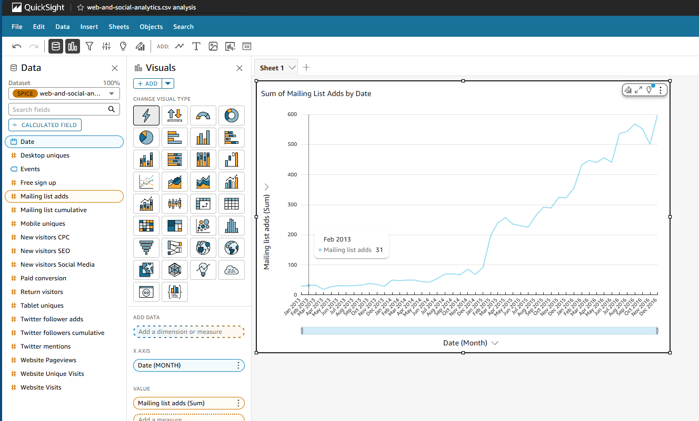

# Resumo

## Curso Udemy QuickSight

- Na Seção 2, aprendi sobre como criar, manipular, agregar e filtrar tabelas dentro do AWS QuickSight
- Na Seção 3, aprendi sobre Tableas Pivot e sobre KPI's (indicadores-chaves de desempenho)
- Na Seção 4, aprendi sobre realização de cálculos com tabelas no AWS QuickSight
- Na Seção 5 e 6, aprendi sobre diferentes filtros e controles (textuais, númericos, temporais) com tabelas dentro do AWS QuickSight
- Na Seção 7, aprendi sobre diferentes gráficos para visualização (pie, donut, bar, area, dentre outros)
- Na Seção 8, aprendi sobre como criar, trabalhar e publicar Dashboards com Temas dentro do AWS QuickSight
- Na Seção 9, aprendi sobre função IF/ELSE e sobre como criar colunas calculadas
- Na Seção 10, aprendi sobre a criação de diferentes métricas com funções SUM/IF
- Na Seção 11, aprendi sobre criar relacionamentos entre tabelas dentro do AWS QuickSight
- Na Seção 12, aprendi sobre Data Preparation
- Na Seção 13, aprendi sobre criar Insights valiosos usando Machine Learning na AWS
- Na Seção 14, aprendi sobre como consultar e acessar recursos através da AWS Community

## Curso AWS QuickSight Getting Started

- Curso com duração de 1h com o objetico de demonstrar uma visão geral da ferramenta AWS QuickSight, o curso abrangiu:

  - Ensino dos conceitos fundamentais da ferramenta, com foco em criação de análises com dados de forma interativa.
  - Criação de dashboards e relatórios visualmente atraentes, usando dados armazenados dentro da AWS oriundos de diferentes fontes (S3, Athena, etc)
  - Casos de uso e arquitetura, com permissões e contas
  - Boas práticas para otimização de desempenho para querys (SPICE)

# Exercicios

Não houve exercícios nessa Sprint

# Evidencias

## Lab AWS QuickSight

- Primeiro iremos acessar a ferramenta pesquisando seu nome no Console

- Em DataSets iremos escolher a opção de Upload, e selecionaremos o arquivo CSV escolhido

- Ao selecionar o arquivo escolheremos a opção Next

- Podemos confirmar a ação clicando em Visualize

- Agora, com o dataset criado, iremos em Analysis e selecionaremos New Analysis

- Clicaremos em Create na janela a seguir 

- Agora, dentro do nosso Sheet, escolheremos os campos Date e Mailing, disponíveis à esquerda

- Iremos alterar a agregação do gráfico de "Day" para "Month"

- O resultado final do laboratório é o gráfico resultante abaixo

# Certificados

